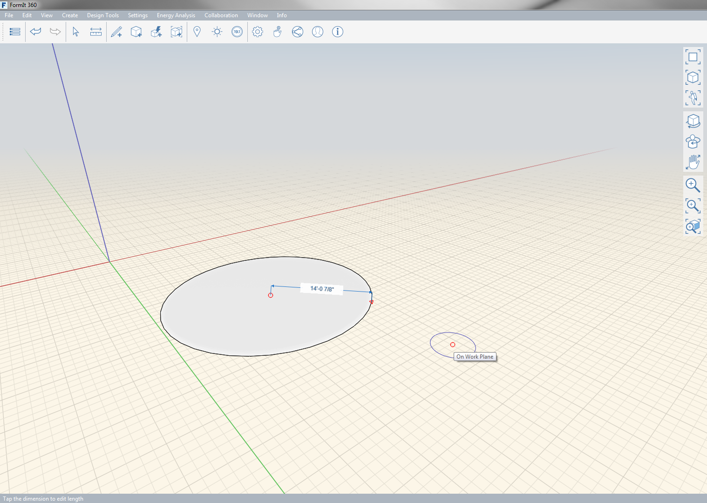

### Circle Tool

---
> Draw a circle in space or on another object.

---

The first step in drawing a circle is choosing the center point and then specify the radius of the circle. When complete the circle will become a face.  

