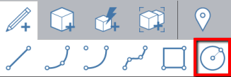
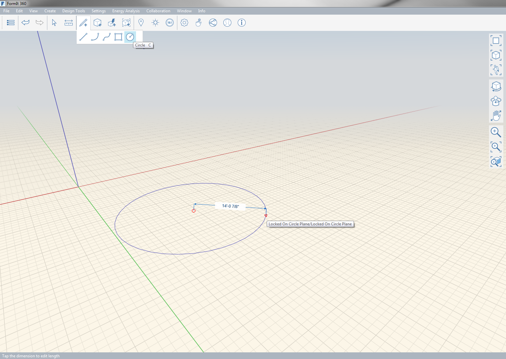
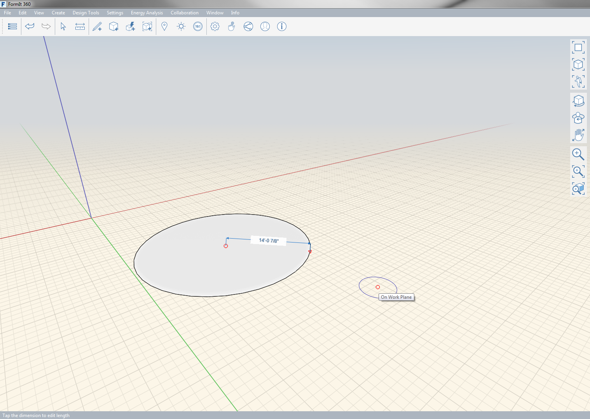

# Circle

Use the Circle tool to draw a circle in space or on another object.

Keyboard: C

To draw a circle, first choose the center point and then specify the circle radius. Next, the circle automatically becomes a face.

