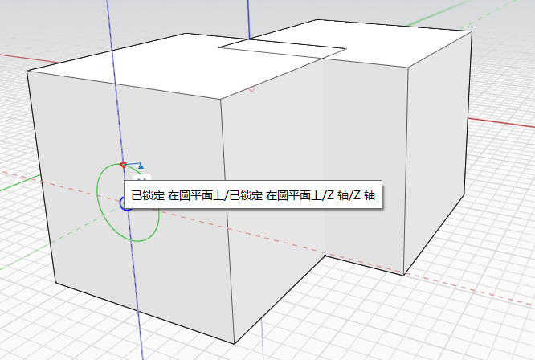

# Okrąg

Narzędzie Okrąg służy do rysowania okręgu w przestrzeni lub na innym obiekcie.

Klawiatura: C

Aby narysować okrąg, najpierw wybierz punkt środkowy, a następnie określ promień okręgu. Okrąg automatycznie staje się powierzchnią.

