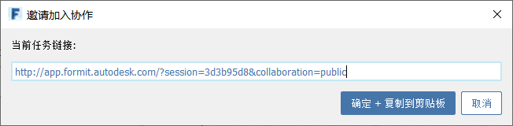

# 协作

FormIt 允许多个用户在 Windows、iPadOS 或 Web 客户端的任意组合上协作编辑 FormIt 模型，以及实时查看更改！

通过 FormIt Pro 固定期限的使用许可，您有权使用“实时协作”功能，从而可以执行以下操作：

* 启动协作任务并邀请同事。
* 从 FormIt Windows、Web 或 iPadOS 应用程序加入协作。
* 与同事协作，以在共享沙盒环境中浏览设计。
* 跟随其他协作者的相机，以从其视角查看模型。
* 在引导他们浏览您的设计时，让客户端跟随您的相机。
* 在任务中与协作者交流。

## 启动协作任务

1. 从“协作”下拉列表中，选择“启动共享任务”。
2. 将链接通过电子邮件发送给协作者。此链接会提示收件人登录其 Autodesk 帐户，以立即开始协作。

