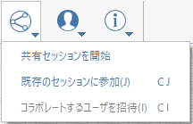

# Collaboration

FormIt allows multiple users to collaboratively edit a FormIt model on any combination of Windows, iPadOS, or Web clients, all while seeing their changes in real time!

With a FormIt Pro subscription, you have access to the Real-time Collaboration feature which allows you to:

* Start a collaboration session and invite colleagues.
* Join a collaboration from the FormIt Windows, Web, or iPadOS apps
* Collaborate with colleagues to explore designs in a shared sandbox environment
* Follow another collaborator's camera to see the model from their viewpoint
* Let a client follow your camera as you guide them through your design
* Chat with collaborators in the session

## Start a Collaboration Session

1. From the Collaboration drop-down, choose "Start sharing session." 
2. Email a link to collaborators. This link prompts recipients to log into their Autodesk accounts to immediate start collaborating.  

