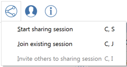
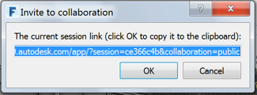

### Collaboration
---

> And now for “one last thing!” Real time collaboration. FormIt allows multiple users (on any combination of iOS or Web clients) to collaboratively edit a FormIt model – while seeing all of their changes in real time!

---

With a FormIt 360 Pro subscription you have access to the Real-time Collaboration feature which allows you to:
- Start a collaboration session and invite colleagues, or clients who do not need to be Pro to join.
- Join a collaboration from the Windows, web, or mobile apps - all you need is an A360 log-in.
- Charette with colleagues to explore designs in a shared sandbox environment.
- Follow another collaborator's camera to see the model from their viewpoint.
- Let a client follow your camera as you drive them through the design.
- Chat with collaborators in the session.
- [Purchase a Pro subscription now.](http://www.autodesk.com/store/products/formit-360-pro?licenseType=cloudSub&term=1month&support=basic)

#### Start a Collaboration Session

1. Start a session – this will start a collaboration session. 

2. You can now email a link to a colleague. When they open the link, they will be asked to log into A360 and then you can start collaborating immediately. 

3. To see this in action, visit this link: <http://formit.autodesk.com/blog/2014/12/04/design-is-a-team-sport-ios-version/>.