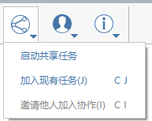

# コラボレーション

FormIt では、Windows、iPadOS、Web のどのクライアントの組み合わせでも、複数のユーザがコラボレートして同じ FormIt モデルを編集でき、そのすべての変更内容をリアルタイムで確認できます。

FormIt Pro のサブスクリプションを購入している場合は、リアルタイム コラボレーション機能を使用して次の操作を行うことができます。

* コラボレーション セッションを開始し、他のメンバーを招待する。
* FormIt の Windows、Web、または iPadOS 用のアプリケーションからコラボレーションに参加する。
* 他のメンバーとコラボレートして、共有サンドボックス環境内で設計を検証する。
* コラボレーションに参加している他のメンバーのカメラをフォローして、そのメンバーの視点でモデルを表示する。
* 自分のカメラをクライアントにフォローしてもらい、設計内をガイドする。
* セッション内で他のメンバーとチャットする。

## コラボレーション セッションを開始する

1. [コラボレーション]ドロップダウンから、[共有セッションを開始]を選択します。
2. コラボレーションに参加するメンバーに電子メールでリンクを送信します。受信したメンバーがこのリンクをクリックすると、Autodesk アカウントにログインするためのプロンプトが表示され、すぐにコラボレーションを開始できます。

