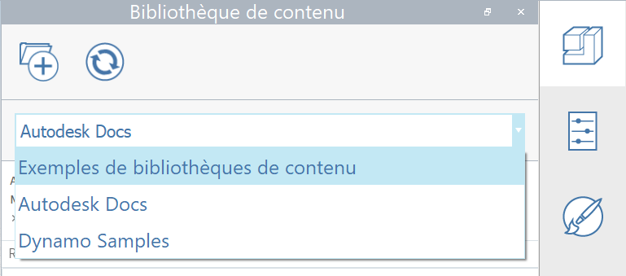

# Knihovna obsahu

Knihovny obsahu představují pohodlný způsob ukládání komponent a dalších položek, které chcete opakovaně používat. Ve výchozím nastavení aplikace FormIt obsahuje několik knihoven vzorků, včetně knihovny vzorků nábytku, a knihovnu vzorových skriptů aplikace Dynamo. Ve verzi FormIt 2021 lze nyní z knihovny obsahu přistupovat k obsahu služby BIM 360 a používat jej.

Další informace o používání knihovny obsahu naleznete [zde](../formit-primer/part-i/import-export-and-content-library.md).

Chcete-li zobrazit několik knihoven obsahu, [podívejte se na tento příspěvek na blogu ](https://formit.autodesk.com/blog/post/content-library).

