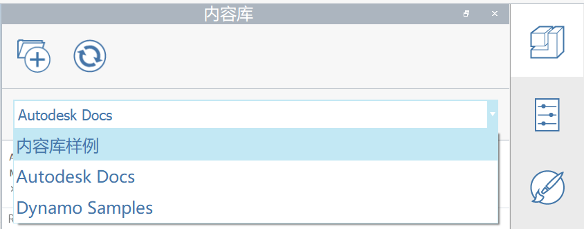

# 內容資源庫

內容資源庫是一個很方便的方式，可以儲存元件和其他重複使用的項目。FormIt 預設包括幾個範例資源庫，包括家具範例資源庫和 Dynamo 範例腳本資源庫。在 FormIt 2021 中，現在可以從內容資源庫存取和使用 BIM 360 內容。

在[這裡](../formit-primer/part-i/import-export-and-content-library.md)進一步瞭解如何使用內容資源庫。

若要查看一些內容資源庫，[請參閱此部落格文章](https://formit.autodesk.com/blog/post/content-library)。

