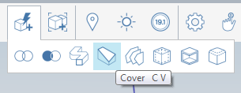
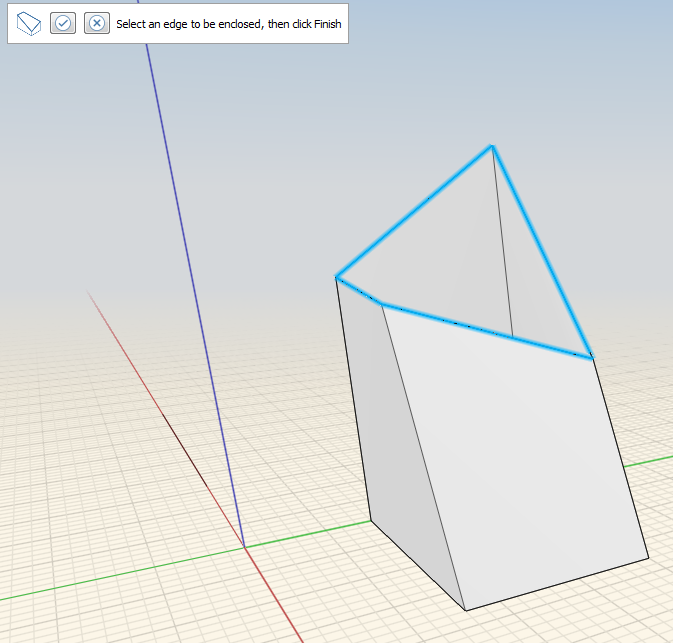
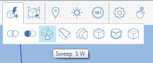
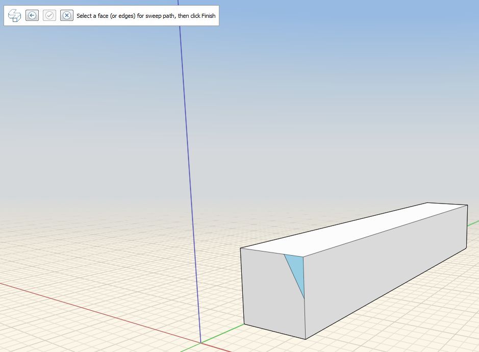
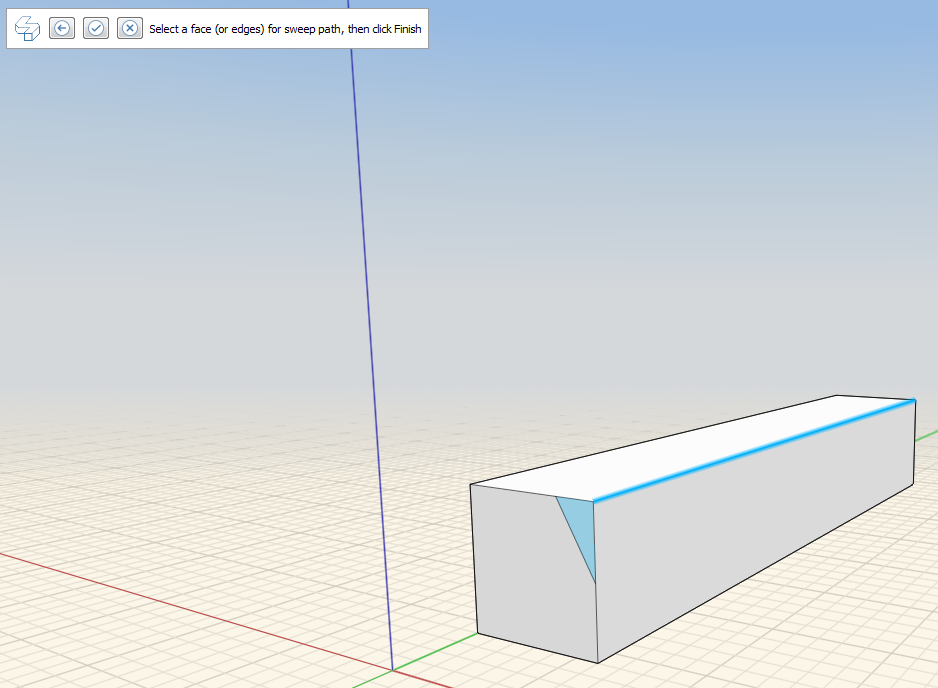
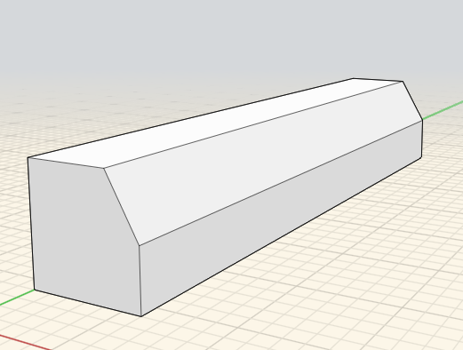
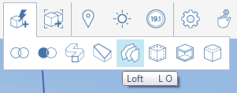
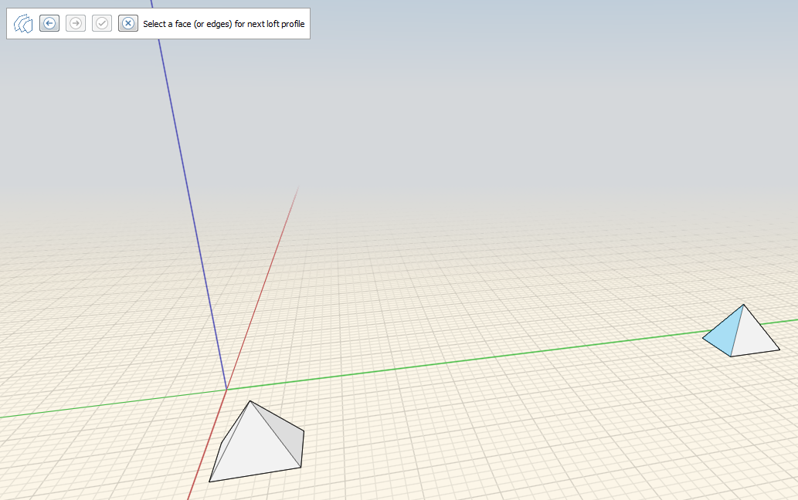
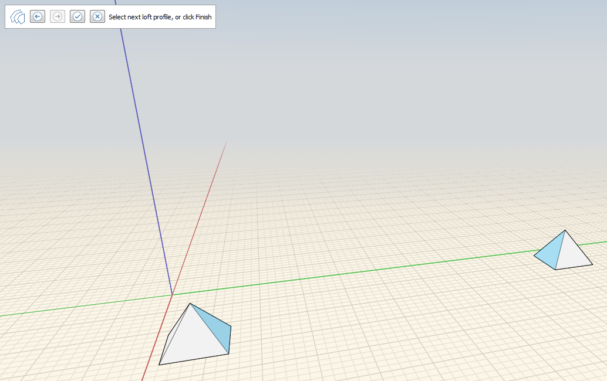
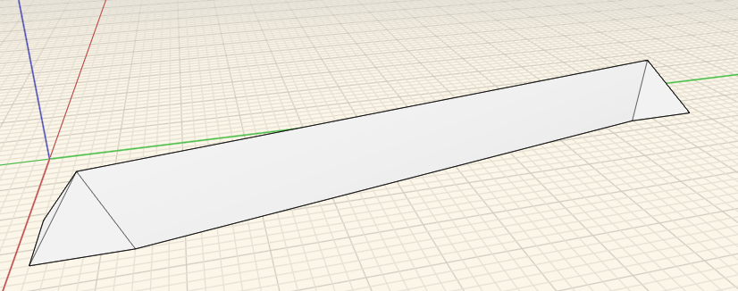

### Cover, Sweep, Loft

---

> Enclose open edges, make geometry changes along a path of edges, and connect multiple profiles or edges.

---

#### To enclose a series of faces

1. Click the cover tool from the action bar.  

2. Click the edges of the object to cover. 

3. Click Finish.   

#### To change geometry along a path

1. Mark a face of an object that you want to cut. 
    

2. Click the sweep tool icon.  
    

3. Select the face you marked earlier. 
    

4. Select the edge you want to cut. 
    
    

5. Click the Finish icon.  The original object is modified along the sweep path. 
    
    

#### To connect multiple profiles or edges

1. Click the Loft icon.  

2. Click the edges on the first object and click the arrow. 
    
    
3. Click the edges on the second object. 
    
    
4. Click Finish.  
    
    