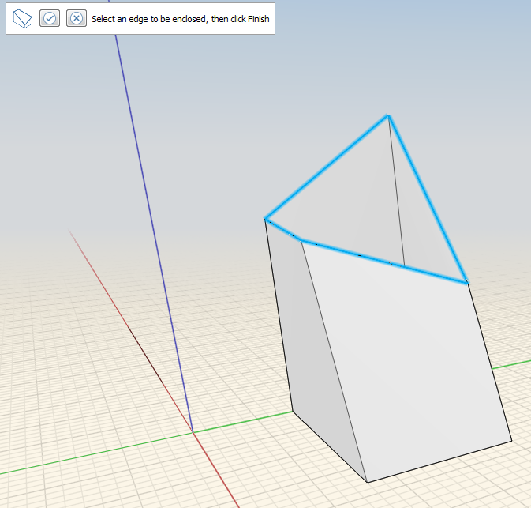
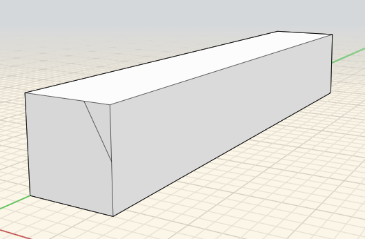
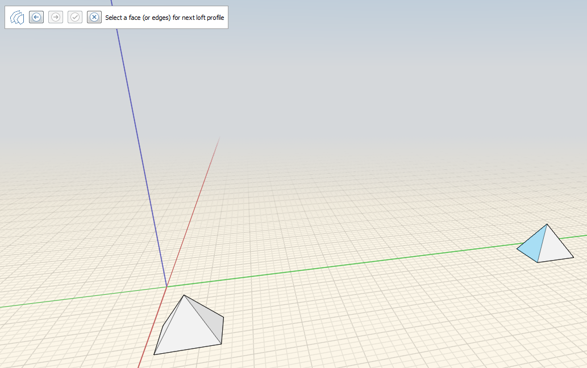

# Cover, Sweep, Loft

Enclose open edges, make geometry changes along a path of edges, and connect multiple profiles or edges.

## To close a series of faces

1. From the **Advanced Geometry Tools** menu in the action bar, click the **Cover** tool.  
2. Click the edges of the object you want to cover.

 

  3. Click **Finish**    
 

## To sweep geometry along a path

1. Use a line to mark the face of an object that you want to cut. 
2. Click the sweep tool icon.   
3. Select the face you marked earlier. 

         

  4. Select the edge you want to cut.

        

  5. Click the **Finish** icon.  The original object is modified along the sweep path. 

## To loft multiple profiles or edges

1. From the **Advanced Geometry Tools** menu in the Action bar, click the **Loft** tool..   
2. Select the face or edges you want to loft on the first object.

   

3. Select the face or edges you want to loft on the second object. Repeat this step for additional objects.

   

4. Click the **Finish** icon. 

   

