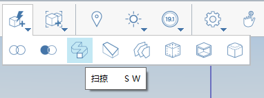

# Nástroje Pokrýt, Tažení, Šablonování

Uzavírejte otevřené hrany, provádějte změny geometrie podél trajektorie hran a propojujte více profilů nebo hran.

## Uzavření řady ploch

1. V nabídce **Pokročilé nástroje geometrie** na panelu Akce klikněte na nástroj **Pokrýt**. 
2. Klikněte na hrany objektu, který chcete pokrýt.

3. Klikněte na tlačítko **Dokončit**    .

## Tažení geometrie podél trajektorie

1. Pomocí čáry označte plochu objektu, který chcete oříznout. 
2. Klikněte na ikonu nástroje Tažení. 
3. Vyberte plochu, kterou jste označili dříve.

         

4. Vyberte hranu, kterou chcete oříznout.

   

5. Klikněte na ikonu **Dokončit**. Původní objekt je upraven podél trajektorie tažení. 

## Šablonování více profilů nebo hran

1. V nabídce **Pokročilé nástroje geometrie** na panelu Akce klikněte na nástroj **Šablonování**. 
2. Na prvním objektu vyberte plochu nebo hrany, u kterých chcete provést šablonování.

   

3. Na druhém objektu vyberte plochu nebo hrany, u kterých chcete provést šablonování. Tento krok opakujte pro další objekty.

   

4. Klikněte na ikonu **Dokončit**. 

   

