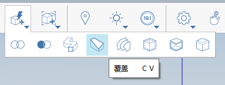

# Покрытие, сдвиг, лофт

Замыкание открытых ребер, изменение геометрии вдоль траектории ребер и соединение нескольких профилей или ребер.

## Замыкание набора граней

1. В меню **Дополнительные инструменты геометрии** на панели действий выберите инструмент **Покрытие**. 
2. Щелкните ребра объекта для покрытия.

3. Нажмите кнопку **Готово.**     

## Сдвиг геометрии вдоль траектории

1. Линией пометьте грань объекта, которую требуется разрезать. 
2. Щелкните значок инструмента сдвига. 
3. Выберите помеченную ранее грань.

         

4. Выберите ребро, которое требуется разрезать.

   

5. Щелкните значок **Готово**. Исходный объект изменяется вдоль траектории сдвига. 

## Лофт нескольких профилей или ребер

1. В меню **Дополнительные инструменты геометрии** на панели действий выберите инструмент **Лофт**. 
2. Выберите грань или ребра первого объекта, к которым требуется применить лофт.

   

3. Выберите грань или ребра второго объекта, к которым требуется применить лофт. Повторите это действие с дополнительными объектами.

   

4. Щелкните значок **Готово**. 

   

