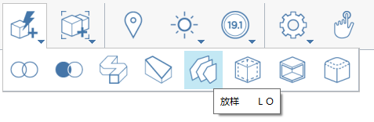

# Abdeckung, Sweep, Erhebung

Diese Funktionen ermöglichen es, offene Kanten zu schließen, Geometrieänderungen vorzunehmen, die einem aus Kanten bestehenden Pfad folgen, und mehrere Profile oder Kanten zu verbinden.

## So schließen Sie eine Reihe von Flächen

1. Klicken Sie im Menü **Erweiterte Geometriewerkzeuge** in der Aktionsleiste auf das Werkzeug **Abdeckung**.  
2. Klicken Sie auf die Kanten des abzudeckenden Objekts.

3. Klicken Sie auf **Fertig stellen**    
   .

## So erstellen Sie ein Sweeping für die Geometrie entlang einem Pfad

1. Verwenden Sie eine Linie, um die Fläche eines zu schneidenden Objekts zu markieren. 
2. Klicken Sie auf das Symbol des Werkzeugs Sweep.   
3. Wählen Sie die zuvor markierte Fläche aus.

         

4. Wählen Sie die zu bearbeitende Kante aus.

   

5. Klicken Sie auf das Symbol **Fertig stellen**.  Das Originalobjekt wird am Sweep-Pfad entlang geändert. 

## So erheben Sie mehrere Profile oder Kanten

1. Klicken Sie im Menü **Erweiterte Geometriewerkzeuge** in der Aktionsleiste auf das Werkzeug **Erhebung**.  
2. Wählen Sie die Fläche oder Kanten aus, die Sie auf dem ersten Objekt erheben möchten.

   

3. Wählen Sie die Fläche oder Kanten aus, die Sie auf dem zweiten Objekt erheben möchten. Wiederholen Sie diesen Schritt für weitere Objekte.

   

4. Klicken Sie auf das Symbol **Fertig stellen**. 

   

