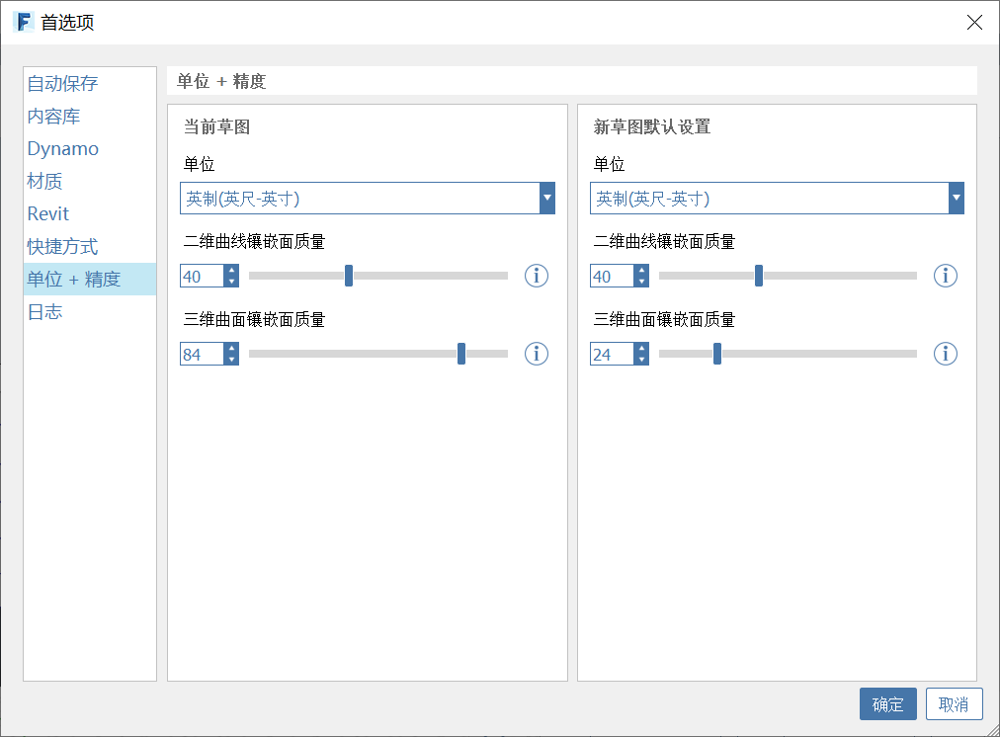

# Kurven- und Flächenfacettierung

FormIt ist ein polyedrisches Modellierungssystem, mit dem Objekte wie Kreise, Bogen und Splines durch eine Reihe gerader Kanten dargestellt werden. Ebenso besteht eine gekrümmte Fläche, wie die Wand eines Zylinders oder einer Kuppel, aus einer Reihe von planaren Flächen mit verdeckten Randkanten.

Vorgabemäßig verwendet FormIt 40 Kanten oder Facetten, um einen Kreis darzustellen, und 24 Facetten, um ein gekrümmtes 3D-Objekt wie einen Zylinder darzustellen. Bei komplexeren Flächen wie einer Kuppel wird mit dem Wert 24 die Anzahl der Umfangsfacettierungen festgelegt, und er wirkt sich auch auf die Dichte der Facettierung der restlichen Form aus.

In FormIt for Windows v18 und neuer können die Werte für die Kurven- und Flächenfacettierung angepasst werden:

.png>)

**Curve Faceting Quality** (Kurvenfacettierungsqualität)

Eine Änderung der Kurvenfacettierungsqualität wirkt sich darauf aus, wie viele Facetten beim Zeichnen neuer Kreise und Bogen in FormIt verwendet werden und wie sich dies beim Platzieren von Grundformen auswirkt. Wenn Sie diesen Wert beispielsweise auf 64 festlegen, wird ein 64-seitiger Vollkreis oder ein Viertelkreis mit 16 Facetten erstellt.

Dieser Wert wirkt sich auch auf die Qualität von Kreisen und Bogen aus, die aus SAT-Dateien importiert wurden, sowie beim Einbacken von Geometrie aus Dynamo. Sie können diesen Wert für neue Skizzen oder nur für die aktuelle Skizze festlegen.

Für vorhandene Kurven können Sie auch das Plugin Rebuild Curve verwenden, um einen **vorhandenen** Bogen oder Kreis mit einer neuen Facettenanzahl rückwirkend neu zu erstellen:

**Surface Faceting Quality** (Flächenfacettierungsqualität)

Eine Änderung dieser globalen Einstellung wirkt sich auf die Qualität von gekrümmten 3D-Flächen aus, die aus SAT-Dateien importiert und aus Dynamo eingebacken wurden.

Wenn Sie diesen Wert beispielsweise auf 64 festlegen und dann eine Kugel aus Dynamo einbacken, werden 64 Flächen um den Kugeläquator sowie 64 Facetten in jedem der Ringe zu den Polen der Kugel verwendet. So entsteht schnell eine beträchtliche Summe. Verwenden Sie höhere Werte mit Vorsicht, da dies in einigen Fällen die Leistung von FormIt beeinträchtigen kann. Wenn Sie ein qualitativ hochwertiges Ergebnis erhalten haben, können Sie es [in ein Netz konvertieren](meshes.md), um die Leistung zu verbessern.

Wenn Sie mit Dynamo arbeiten, können Sie die Facettierungsqualität ändern und in der Gruppe Eigenschaften auf Run Graph (Diagramm ausführen) klicken, ohne Parameter zu ändern, um die neue Anzahl der Facettierungen zu nutzen:

Wie bei Kurven können Sie die Qualität der Flächenfacettierung für neue Skizzen oder nur für die aktuelle Skizze festlegen.

Beachten Sie, dass Facettierungswerte derzeit auf ein Vielfaches von 4 beschränkt sind. Wenn Sie Zahlen also manuell eingeben, rundet FormIt auf das nächste Vielfache auf. Sie können die Schieberegler und Pfeile verwenden, um zwischen den zulässigen Werten zu wechseln.

