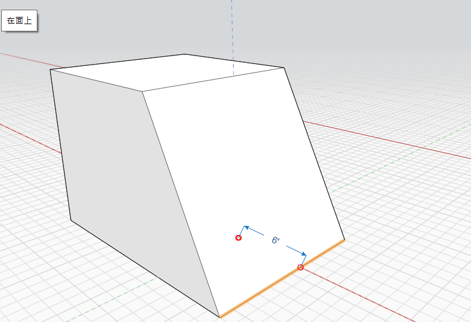

# Suprimir, Editar y Mover

Elimine un objeto, cambie su ubicación o modifique sus propiedades.

## Eliminar

Realice primero una selección de geometría. A continuación, haga clic con el botón derecho para ver el menú contextual, donde puede hacer clic en la **herramienta Suprimir**. También puede pulsar la tecla Supr del teclado.

## Editar

Al utilizar muchas de las herramientas de edición, como Mover, Matriz, Empujar-tirar cara y Desfase, aparecerá un cuadro de cota de color azul. Puede hacer clic en esta cota después de finalizar la operación e introducir un valor específico. También puede comenzar a escribir un valor numérico para acceder al cuadro de diálogo Editar cota. También puede pulsar la tecla Tab para abrir el cuadro de diálogo Editar cota, pero ya no es necesario usar la tecla Tab con FormIt en Windows v17 y versiones posteriores.

## Mover bordes, caras u objetos

Seleccione primero el borde, la cara o el objeto. La herramienta Mover se activa automáticamente. Desplace el cursor para ver los forzados de cursor y los puntos de deducción a fin de especificar dónde desea iniciar la operación de desplazamiento; haga clic para empezar. Ahora coloque el cursor para ver los forzados de cursor y los puntos de deducción en la ubicación en la que desea mover el objeto. Haga clic de nuevo para colocar el objeto.

