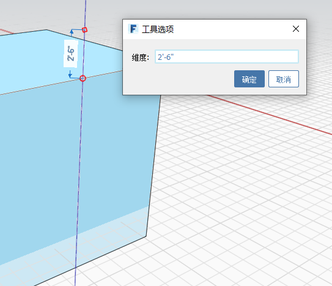
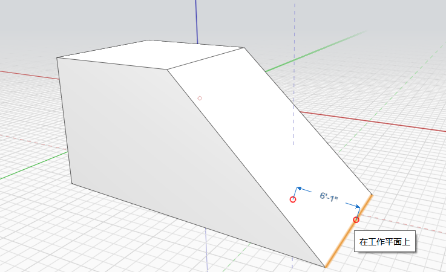

# Löschen, Bearbeiten, Verschieben

Sie können Objekte entfernen, neu positionieren oder ihre Eigenschaften ändern.

## Löschen

Wählen Sie zunächst Geometrie aus. Öffnen Sie dann durch Rechtsklicken das Kontextmenü und klicken Sie dort auf das **Werkzeug Löschen**. Alternativ können Sie die Entf-Taste auf der Tastatur drücken.

## Bearbeiten

Bei vielen der Bearbeitungswerkzeuge, etwa Verschieben, Reihe, Fläche schieben/ziehen und Versetzen, wird ein blauer Rahmen für die Bemaßung angezeigt. Nachdem Sie Ihren Vorgang abgeschlossen haben, können Sie auf diese Bemaßung klicken und einen bestimmten Wert eingeben. Sie können auch einfach einen numerischen Wert eingeben, um das Dialogfeld Bemaßung bearbeiten zu öffnen. Alternativ können Sie die TABULATORTASTE drücken, um das Dialogfeld Bemaßung bearbeiten aufzurufen. In FormIt for Windows v17 und höher ist die TABULATORTASTE jedoch nicht mehr erforderlich.

## Kanten, Flächen oder Objekte verschieben

Wählen Sie zuerst die Kante, die Fläche oder das Objekt aus. Das Werkzeug Verschieben wird automatisch aktiviert. Setzen Sie den Cursor an die gewünschte Stelle, um Fang- und Ableitungspunkte für den Anfangspunkt der Verschiebung einzublenden, und klicken Sie, um zu beginnen. Setzen Sie jetzt den Cursor an die benötigte Stelle für die Anzeige von Fang- und Ableitungspunkten für die Zielposition der Verschiebung. Klicken Sie erneut, um das Objekt zu platzieren.

