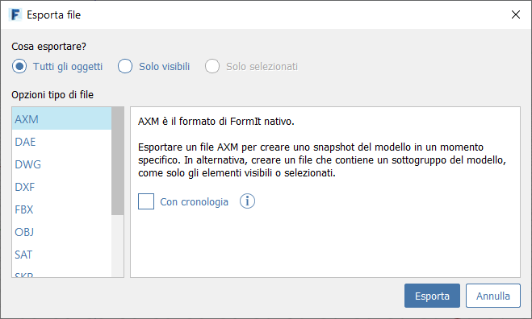

# Importation et exportation de données

## Importation de données

Les formats de fichiers suivants peuvent être importés directement.

* **OBJ** : les fichiers de maillage 3D OBJ sont importés en tant que groupe FormIt unique. Aucun matériau n’est importé.
* **DWG** : les fichiers DWG 2D et 3D sont importés en tant que groupe FormIt unique. Les couleurs des objets sont prises en charge.
* **STL** : les fichiers de maillage 3D STL sont importés en tant que groupe FormIt unique.
* **SAT** : les fichiers de modèle solide SAT sont importés en tant que groupe FormIt unique.
* **SKP** : les fichiers SketchUp sont importés. Les groupes et les composants sont importés en tant que groupes FormIt. Les calques et les matériaux sont pris en charge.

[**En savoir plus sur l’utilisation des données importées**](../formit-primer/part-i/import-export-and-content-library.md)

## Exportation de données

FormIt permet d’exporter les formats de fichiers suivants : AXM \(fichier FormIt\), DWG, SKP, FBX, SAT, STL, DAE, DXF, OBJ \(matériaux et 3D dans un seul fichier ZIP\), images PNG.

Lors de l’exportation de fichiers individuels, vous pouvez choisir d’exporter **Tous les objets**, **Visible uniquement** ou **Sélection uniquement**.

