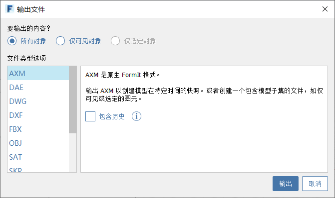

# Importar e exportar dados

## Como importar dados

É possível importar os seguintes formatos de arquivo.

* **OBJ**: os arquivos de malha 3D OBJ são importados como um único grupo FormIt. Nenhum material é importado.
* **DWG**: os arquivos DWG 2D e 3D são importados como um único grupo FormIt. As cores de objetos são suportadas.
* **STL**: os arquivos de malha 3D STL são importados como um único grupo FormIt.
* **SAT**: os arquivos de modelo sólido SAT são importados como um único grupo FormIt.
* **SKP**: os arquivos do SketchUp são importados. Os grupos e componentes são importados como grupos do FormIt. As camadas e os materiais são suportados.

[**Saiba mais sobre como trabalhar com dados importados**](../formit-primer/part-i/import-export-and-content-library.md)

## Como exportar dados

O FormIt pode exportar os seguintes formatos de arquivo: AXM \(arquivo FormIt\), DWG, SKP, FBX, SAT, STL, DAE, DXF, OBJ \(materiais e 3D em um único arquivo ZIP\), imagens PNG.

Ao exportar arquivos individuais, é possível optar por exportar **Todos os objetos**, **Somente visíveis** ou **Somente selecionados**.

