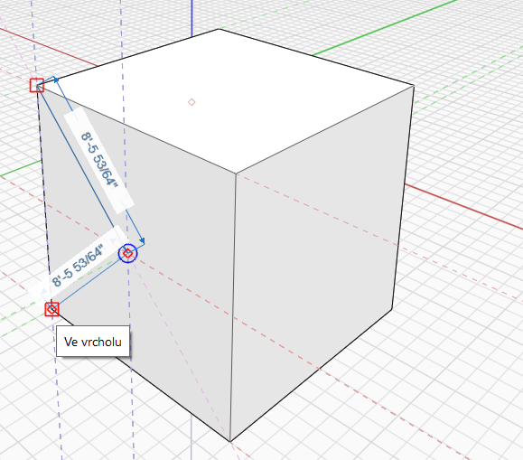
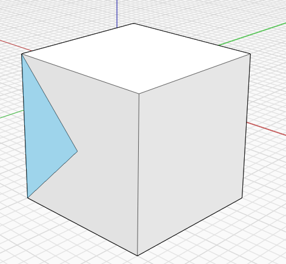
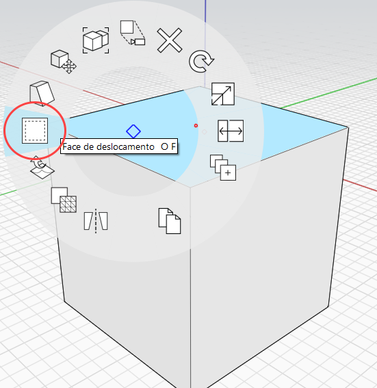
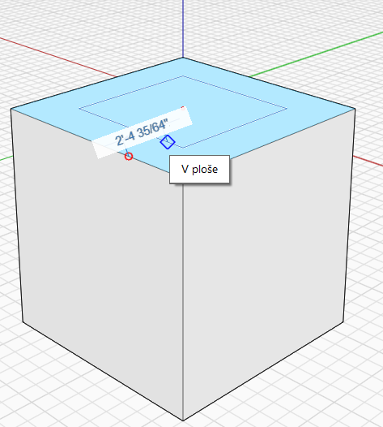
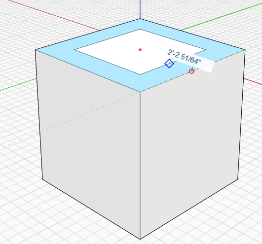

# Грани: выдавливание, вырезание и смещение

Можно выдавливать и вытягивать грани, наносить новые формы на существующие, а также создавать новые смещенные ребра.

## Вытягивание

Для выдавливания или вытягивания грани сначала выберите грань щелчком мыши, а затем щелкните и перетащите ее. Грань можно перемещать как внутрь, так и наружу. С помощью мыши задайте точки привязки и вспомогательные точки на других элементах модели. Щелкните еще раз, чтобы завершить перемещение грани. Удерживайте нажатой клавишу CTRL, чтобы сохранить исходные ребра.

## Клеймение

При клеймении форм используйте инструмент «3D-эскиз» для построения линий, дуг, сплайнов, прямоугольников и окружностей на существующих гранях. Он позволяет создавать новые грани, которые можно выдавливать и вытягивать независимо от исходной грани.

  

## Смещение

Для смещения грани объекта выполните следующие действия.

1. Сначала выберите грань, которую требуется отредактировать, а затем щелкните правой кнопкой мыши, чтобы открыть **контекстное меню**.
2. В **контекстном меню** выберите инструмент **Сместить грань**.
3. Наведите курсор на выбранную грань и скорректируйте отображаемые линии для получения нужного эффекта смещения.
4. Щелчком мыши завершите смещение. Теперь можно выдавливать и вытягивать смещенную грань независимо от исходной.

  
  

