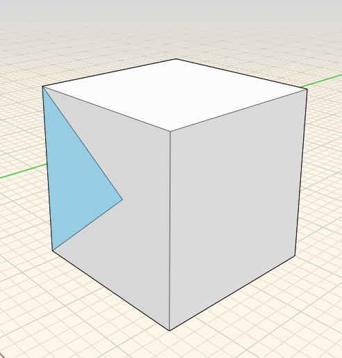

### Extrude, Cut and Offset Faces
---
> Push or pull a face, or imprint new shapes on existing ones, or change create new edges offset from the original ones.

---

#### Extrude
To push and pull a face, select a face with a single click, then click and drag. The face will move back and forth, you can now move your mouse to snap and inference on other model elements. Click again to finish moving the face. Hold down the CTRL key to retain the original edges.

#### Imprint
To imprint shapes, use a 3D Sketch tool to draw lines, arcs, splines, rectangles or circles onto existing faces. This action creates new faces that can be push / pulled independently of the original face.

#### Offset
To offset a face, after face selection, click on the offset tool from the context menu. Then, move your mouse over the face to create a series of edges offset from the original edges.

