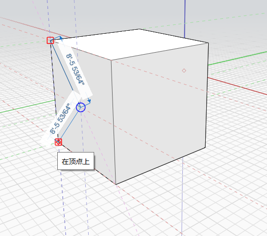

# 면: 돌출, 절단 및 간격띄우기

면을 밀거나 당기고, 기존 면에 새 모양을 각인하거나, 새 간격띄우기 모서리를 작성할 수 있습니다.

## 돌출

면을 밀거나 당기려면 한 번 클릭하여 면을 선택한 다음, 클릭하여 끕니다. 면이 앞뒤로 이동하므로 마우스를 이동하여 다른 모델 요소에 스냅하고 추정할 수 있습니다. 다시 클릭하여 면 이동을 완료합니다. Ctrl 키를 길게 눌러 원래 모서리를 유지합니다.

## 각인

모양을 각인하려면 3D 스케치 도구를 사용하여 선, 호, 스플라인, 직사각형 또는 원을 기존 면에 그립니다. 그러면 원래 면과 독립적으로 밀거나 당길 수 있는 새 면이 작성됩니다.

  

## 간격띄우기

객체의 면 간격을 띄우려면

1. 먼저 편집하려는 면을 선택한 다음, 마우스 오른쪽 버튼을 클릭하여 **상황에 맞는** 메뉴를 표시합니다.
2. **상황에 맞는** 메뉴에서 **면 간격띄우기** 도구를 클릭합니다.
3. 마우스 커서를 선택한 면 위로 이동하고 원하는 간격띄우기 효과에 도달할 때까지 표시되는 선을 조정합니다.
4. 아무 곳이나 클릭하여 간격띄우기를 완료합니다. 이제 독립적으로 간격띄우기 면을 밀거나 당길 수 있습니다.

  
  

