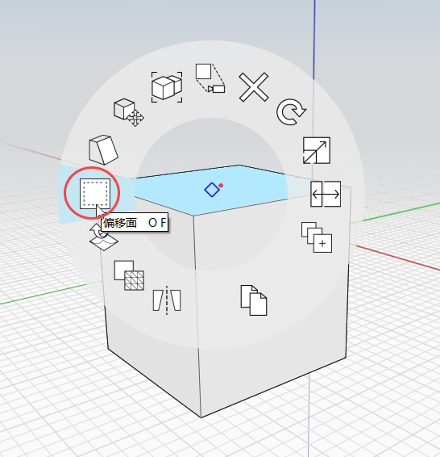
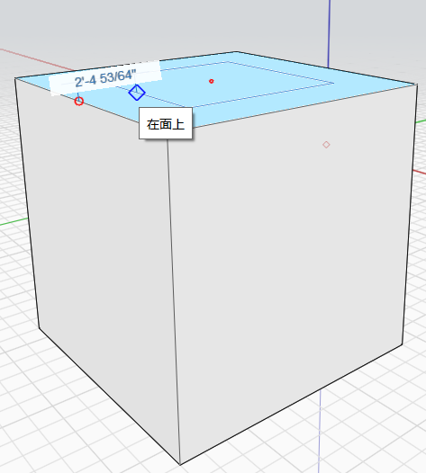

# Superfici: Estrudi, Taglia e Offset

È possibile spingere o trascinare una superficie, imprimere nuove forme su quelle esistenti o creare nuovi bordi di offset.

## Estrudi

Per spingere o trascinare una superficie, selezionarla con un singolo clic, quindi fare clic e trascinare. La superficie si sposta avanti e indietro; ora è possibile spostare il mouse per eseguire lo snap e la deduzione su altri elementi del modello. Fare nuovamente clic per terminare lo spostamento della superficie. Tenere premuto il tasto CTRL per mantenere i bordi originali.

## Imprimi

Per imprimere forme, utilizzare uno strumento Disegno 3D per disegnare linee, archi, spline, rettangoli o cerchi su superfici esistenti. Questa azione consente di creare nuove superfici che possono essere spinte o trascinate indipendentemente dalla superficie originale.

  

## Offset

Per eseguire l'offset della superficie di un oggetto:

1. Selezionare innanzitutto la superficie che si desidera modificare, quindi fare clic con il pulsante destro del mouse per visualizzare il menu **contestuale**.
2. Dal menu **contestuale**, fare clic sullo strumento **Offset superficie**.
3. Spostare il cursore del mouse sulla superficie selezionata e regolare le linee visualizzate fino a raggiungere l'effetto di offset desiderato.
4. Fare clic in un punto qualsiasi per completare l'offset. È ora possibile spingere o trascinare la superficie di offset in modo indipendente.

  
  

