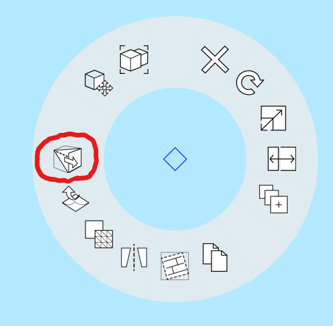

# Faces: Flatten

Use the **Flatten Faces** tool to force two or more object faces into the same plane. 

When two or more object faces are selected, you can select the **Flatten Faces** tool from the **Context** menu. You can also access **Flatten Faces** using the shortcut "**FL**."

**Flatten Faces** can be useful as a repair tool when a face that should be planar becomes unexpectedly faceted \(with smooth edges between the facets\), either when importing lower-fidelity data like [SketchUp models](https://formit.autodesk.com/blog/post/using-formit-to-get-sketchup-data-into-revit#flatten), or after accidentally moving a vertex or edge which causes a face to get faceted or triangulated.

You can also use **Flatten Faces** as a design tool for aligning or extending shapes. To do this,  first select a guide surface, then select additional faces to flatten to the plane of the first surface.

Check out the video below to see the power and versatility of **Flatten Faces**:



