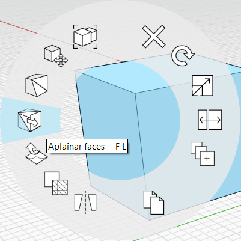

# 面：展平

使用**“展平面”**工具强制两个或多个对象面进入同一平面。

选择两个或多个对象面后，可以从**“上下文”**菜单中选择**“展平面”**工具。还可以使用快捷键**“FL”**访问**“展平面”**。

**“展平面”**在以下情况下作为修复工具可能很有用：应为平面的面意外成为镶嵌面（镶嵌面之间有平滑边），无论是输入保真度较低的数据（如 [SketchUp 模型](https://formit.autodesk.com/blog/post/using-formit-to-get-sketchup-data-into-revit#flatten)）时，还是意外移动顶点或边后导致面成为镶嵌面或三角化面。

还可以将**“展平面”**用作设计工具，来对齐或延伸形状。为此，先选择引导曲面，然后选择其他面以展平到第一个曲面的平面。

请观看以下视频，了解**“展平面”**的强大功能和多功能性：



