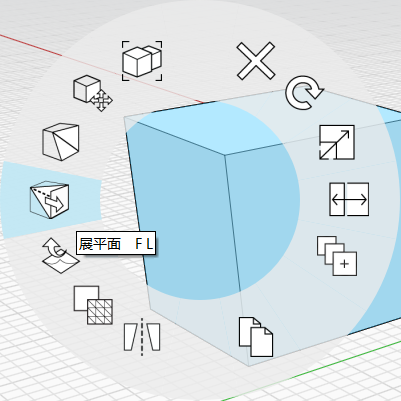

# Plochy: Vyrovnání

Pomocí nástroje **Vyrovnat plochy** můžete vynutit, aby dvě nebo více ploch objektů bylo ve stejné rovině.

Pokud jsou vybrány dvě nebo více ploch objektů, můžete v **místní** nabídce vybrat nástroj **Vyrovnat plochy**. K nástroji **Vyrovnat plochy** můžete také získat přístup pomocí klávesové zkratky **FL**.

Nástroj **Vyrovnat plochy** se hodí k opravám v případech, kdy u ploch, které měly být rovinné, neočekávaně vzniknou plošky \(s hladkými hranami mezi plochami\), a to buď při importu dat s nižší věrností, například [modelů aplikace SketchUp](https://formit.autodesk.com/blog/post/using-formit-to-get-sketchup-data-into-revit#flatten), nebo po náhodném přesunutí vrcholu nebo hrany, který způsobí, že plocha bude složena z plošek nebo trojúhelníků.

Nástroj **Vyrovnat plochy** můžete také použít k zarovnání nebo prodloužení tvarů. Chcete-li to provést, vyberte nejprve vodicí plochu a poté vyberte další plochy, které chcete vyrovnat s rovinou prvního povrchu.

Prohlédněte si následující videofilm, který zobrazuje výkon a univerzálnost nástroje **Vyrovnat plochy**:



