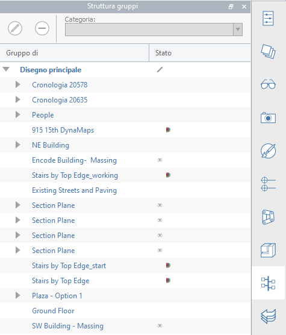

# Arborescence des groupes

La palette **Arborescence des groupes** fournit un emplacement unique pour gérer tous les groupes du fichier. L’arborescence affiche les groupes imbriqués et la colonne État indique le groupe en cours de modification et si le groupe provient de Dynamo ou de Revit.

* **Sélectionner** : chaque occurrence est répertoriée individuellement. Sélectionnez une instance dans l’arborescence et les instances sont sélectionnées dans la scène 3D.
* **Modifier** : pour modifier un groupe, utilisez l’icône en forme de stylo située dans la partie supérieure de la palette ou cliquez avec le bouton droit de la souris, puis choisissez Modifier.
* **Renommer** : pour renommer un groupe, double-cliquez sur son nom ou cliquez avec le bouton droit de la souris, puis choisissez Renommer.
* **Supprimer** : pour supprimer un groupe, utilisez l’icône \(**-**\) située dans la partie supérieure de la palette ou cliquez avec le bouton droit de la souris, puis choisissez Supprimer.
* **Modifier la catégorie** : pour modifier la catégorie d’un groupe, sélectionnez le groupe et utilisez la liste déroulante Catégorie située dans la partie supérieure de la palette.

