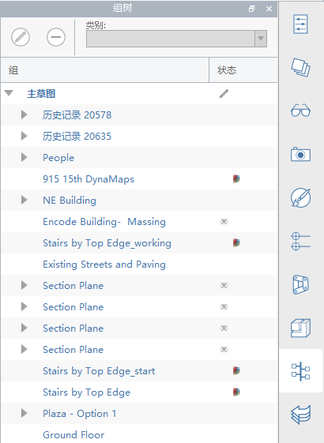

# Drzewo grup

Paleta **Drzewo grup** zapewnia jedno miejsce do zarządzania wszystkimi grupami w pliku. W widoku drzewa są wyświetlane grupy zagnieżdżone, a w kolumnie Stan są wyświetlane informacje o tym, czy grupa jest aktualnie edytowana, i o tym, czy pochodzi ona z dodatku Dynamo, czy z programu Revit.

* **Wybieranie**: Każde wystąpienie jest prezentowane osobno. Wybierz wystąpienie w drzewie, a wystąpienie (lub wystąpienia) zostanie wybrane w scenie 3D.
* **Edytowanie**: Aby edytować grupę, użyj ikony długopisu na górze palety lub kliknij prawym przyciskiem myszy i wybierz polecenie Edytuj.
* **Zmiana nazwy**: Aby zmienić nazwę grupy, kliknij ją dwukrotnie lub kliknij prawym przyciskiem myszy i wybierz polecenie Zmień nazwę.
* **Usuwanie**: Aby usunąć grupę, użyj ikony \(**-**\) na górze palety lub kliknij prawym przyciskiem myszy i wybierz polecenie Usuń.
* **Zmiana kategorii**: Aby zmienić kategorię grupy, wybierz grupę i użyj listy rozwijanej Kategoria na górze palety.

