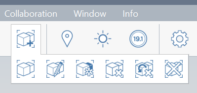

# Groups

One of the most basic, and important techniques in FormIt workflows involves Grouping. Groups allow you to keep your geometry from 'sticking together'. In addition Groups allow you to set up parent + child relationships between copied elements - so if you update one, they both update. Learn more about Groups [here](/Building-the-Farnsworth-House/Grouping-Objects.md)

Groups can be created and edited in two ways - either from the context menu or from the main toolbar.

## Groups Interactions

1. Select the elements you'd like to group together - this can include edges, faces, solids, and other groups. Imported images, and satellite images cannot be grouped

2. Once you've selected what you want to group, right click and choose **Group \(G\)**

3. Once you've created a group you can select it with a single click. Note the dashed lines when selecting - this helps indicate the group's extents

4. Double click on a group to edit it - this puts you into a special mode where you cannot select \(but you can see and snap to\) elements outside of the current group. You can also hide the elements outside of the current group by hitting the **H** keyboard shortcut

5. You can create groups within groups - these are called nested groups

6. Exit Group edit mode by double clicking off into space. Once you start working with nested groups you can navigate up one level of a group at a time with a single click off in space

7. Once you copy a group, then you have automatically made a relationship between these groups - if you edit one and change it, the same change will occur in all related groups

8. If you want to sever the relationship between groups - select one, or several - and choose to make that group unique

9. There is a shortcut to select all of the related groups. Hover over a group and hit the Tab key - this will highlight all related groups. Now click to select them - and you can perform an action on all groups at once - delete, group, etc...

## Groups Context menu and Toolbar access

## 

1. **Group Elements** - if you have selected elements then they can be grouped, or you can select elements after hitting this icon to group elements together. You will need to confirm with the checkbox in the group edit toolbar in the upper left corner of the canvas

2. **Edit the Group** - This command has a unique ability to choose the specific group you'd like to edit - even if it is a deeply nested group

3. **Make Unique** - This command will sever the relationship if the currently selected group \(or groups!\) from other groups

4. **Ungroup** - this command will ungroup the current selection, but not ungroup any nested groups

5. **Ungroup All Nested** - this command ungroups everything below the currently selected group

6. **Ungroup All** - this command will flatten the entire model leaving no groups in the model

## Groups and Revit

If you're familiar with Revit Families, then you are familiar with the concept of Groups in FormIt. FormIt groups have extended a few features to make them translate to Revit with more intelligence.

You can specify the 'category' of Groups in FormIt and they will become families of this category when you import FormIt to Revit. You can set the category in FormIt in the Properties palette of an edited group - or in the Groups Tree palette

You can specify the name of your FormIt group too - this is handy for general legibility of your model - and when you import to Revit you can Filter visibility of elements by using the name of the group.

Note that Nested Groups in FormIt are un-nested when importing to Revit - this prevents a deeply nested Revit family which may not have been your intention when modeling in FormIt.

