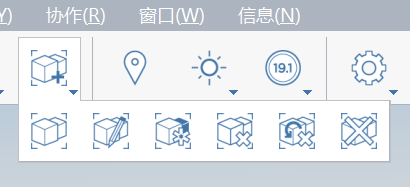

# グループ

FormIt ワークフローで最も基本的でかつ重要なテクニックの 1 つに、グループ化があります。グループを使用すると、ジオメトリが互いに固定されないようにし、コピーした要素間の親子関係を設定して 1 つの要素を更新すると、両方の要素が更新されるようにすることができます。グループの詳細は[こちら](../formit-primer/part-i/grouping-objects.md)をご覧ください。

グループは、選択したグループのコンテキストメニューから、またはメイン ツールバーから作成および編集できます。

## グループの相互作用

**グループを作成**するには、グループ化する要素\(エッジ、面、ソリッド、その他のグループを含む\)を選択し、右クリックします。コンテキスト メニューから**[グループ\(G\)]**ツールを選択します。読み込まれたイメージと衛星画像はグループ化できません。

**グループを選択**するには、グループをシングルクリックします。グループを選択すると破線が表示されます。この線はグループの合計サイズを示します。

**グループを編集**するには、グループをダブルクリックします。これにより、編集モードが起動し、現在のグループの外側にある要素を表示およびスナップできますが、選択することはできません。キーボード ショートカットの**[H]**を使用して、現在のグループの外側にある要素を非表示にすることもできます。

**グループ内にグループ**を作成できます。それらは**ネストされたグループ**と呼ばれ、グループ編集モード内で作成できます。ネストされたグループ内で 1 レベル上に移動するには、グループの外側の任意の場所をクリックします。

**グループ編集モードを終了**するには、グループの外側の任意の場所をダブルクリックします。

**グループをコピー**して、元のグループとそのコピー間の関係を作成できます。コピーしたグループを編集すると、関連するすべてのグループに同じ変更が反映されます。

**コピーしたグループ間の関係を切断する**には、分離するグループを選択して右クリックし、コンテキスト メニューから**[固有にする]**を選択します。[グループ]ツールバーから[固有にする]を選択することもできます。

**すべての関連グループを選択**するには、グループにカーソルを合わせて[Tab]キーを押します。すべての関連グループがハイライト表示されたら、グループをクリックして選択します。その後、すべてのグループに対して一度にアクションを実行できます。

[**グループ ツリー**](groups-tree.md)では、1 つの場所でプロジェクト内のすべてのグループを表示および管理できます。

## グループ コンテキスト メニューとツールバー アクセス

## 

**グループ要素**

[グループ]ツールバーからグループを作成するには、1 つまたは複数の要素を選択し、**[グループを作成]**アイコンを選択してから**[終了]**アイコンを選択します。または、[グループ]ツールバーから**[グループを作成]**を選択し、グループ化する要素を選択して**[終了]**アイコンを選択します。

**[グループ]ツールバーからグループを編集**するには、**[グループを編集]**アイコンを選択し、編集するグループをクリックします。編集が終了したら、**[終了]**アイコンを選択します。このツールを使用すると、深くネストされていても、編集する特定のグループを選択できます。

**ツールバーからグループを固有にするには、**[グループ]ツールバーの**[固有にする]**アイコンを選択します。さらに、[グループ]ツールバーから**[固有にする]**を選択し、固有にするグループを選択して**[終了]**アイコンをクリックします。

**[グループ]ツールバーからグループ解除する**には、該当するグループを選択し、[グループ]ツールバー メニューから**[グループ解除]**アイコンを選択します。これにより、現在選択されているグループがグループ解除されますが、ネストされたグループはグループ解除されません。または、ツールバーから**[グループ解除]**を選択し、該当するグループを選択して、**[終了]**アイコンをクリックします。

**現在選択しているグループの下にネストされているすべてのグループをグループ解除する**には、ネストされたグループを持つグループを選択し、[グループ]ツールバーから**[ネストをすべてグループ解除]**のアイコンを選択します。

**モデル内のすべてのグループをグループ解除する**には、[グループ]ツールバーから**[すべてグループ解除]**ツールを選択します。

## グループと Revit

Revit **ファミリ**に慣れている場合は、FormIt でのグループの概念にもすぐに馴染めることでしょう。FormIt グループには、Revit にインテリジェントに転送するための機能が用意されています。

**FormIt グループ カテゴリ**

FormIt のグループの**カテゴリ**を指定して、FormIt グループを Revit に読み込むときに、FormIt グループが同じカテゴリのファミリになるようにすることができます。FormIt グループにカテゴリを割り当てるには、グループを選択し、**[グループ編集]**モードを開始し、**[プロパティ]**パレットを使用してカテゴリを選択します。**[グループ ツリー]**パレットでカテゴリを割り当てることもできます。

**FormIt グループ名**

**[プロパティ]**パレットを使用して、FormIt グループの名前を指定することもできます。これは、ユーザ独自のモデルをナビゲートする場合に役立ちます。モデルを Revit に読み込む場合、グループの名前を使用して要素を簡単に絞り込むことができます。

**FormIt 内のネストされたグループは、ネストされたグループとして Revit に読み込まれません**。これにより、Revit ファミリが深くネストされることを回避できます。

