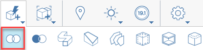
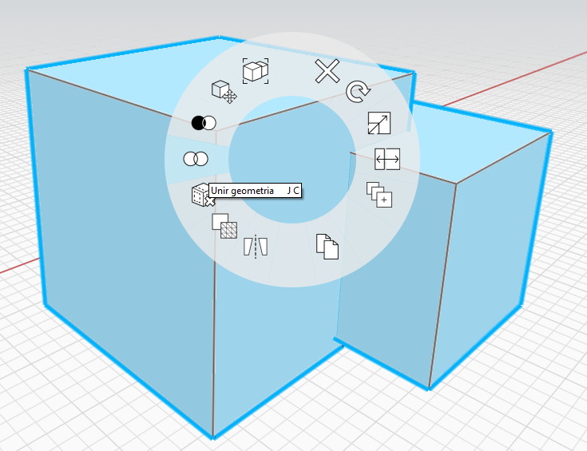

# Boolean Join

You can join one object or group into another with the Join tool. There are two ways to access the Join tool:

## Run the Join command first

Keyboard: J G

Run the Join command and follow the mode instruction in the upper left of the screen

Single-click to select an object to join into.

Single-click to select an object or group to be joined.

Click the checkmark to finish the command.

## Select objects first

1. Double-click to select the object to be joined \(single click for a group\).
2. Holding the **CTRL key,** double click an overlapping object you want to join with the first object.
3. Right click on any of the objects and choose the Join Tool in the Context Menu.

