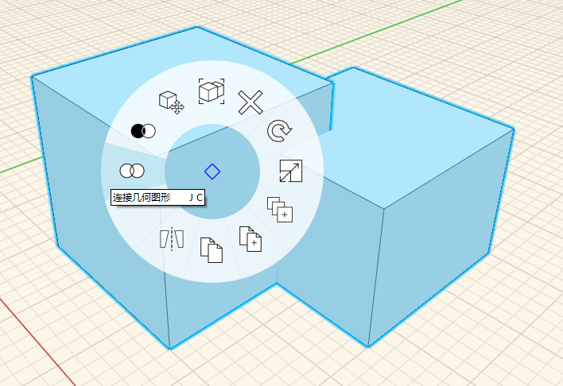

# Booleovské spojení

Pomocí nástroje Spojit můžete spojit jeden objekt nebo skupinu s jiným objektem či skupinou. Nástroj Spojit lze spustit dvěma způsoby:

## Jako první je spuštěn příkaz Spojit

Klávesnice: J G

Spusťte příkaz Spojit a postupujte podle pokynů v levé horní části obrazovky.

Kliknutím vyberte objekt, k němuž chcete spojení provést.

Kliknutím vyberte objekt nebo skupinu, která má být spojena.

Kliknutím na značku zaškrtnutí dokončete příkaz. 

## Jako první jsou vybrány objekty

1. Dvojitým kliknutím vyberte objekt, který chcete spojit \(kliknutím vyberete skupinu\).
2. Podržte klávesu **Ctrl** a dvakrát klikněte na překrývající se objekt, který chcete spojit s prvním objektem.
3. Klikněte pravým tlačítkem myši na kterýkoli z objektů a v místní nabídce vyberte nástroj Spojit.

