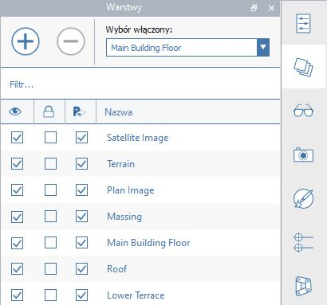
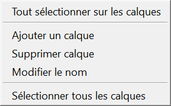

# Layers

Use Layers to control the visibility of FormIt objects. 

See Layers in action by following the [FormIt Primer.](https://windows.help.formit.autodesk.com/building-the-farnsworth-house/control-visibility-with-layers)

## Creating and Naming Layers

In the Layers panel, you can create and name your Layers by clicking the "**+**" icon. 

  

You can double-click the name to rename the Layer, or toggle the visibility of its objects by checking and unchecking the left box. Use the right checkbox to lock and unlock layers. A Locked layer will still be visible  but not selectable or editable.

## Managing Objects on Layers

Select objects in the canvas, then use the drop-down at the top of the Layers panel to indicate which Layer the selected objects should be placed on. 

FormIt does not have the concept of a "default" or "working layer." All new geometry will be created on "No Layer" and you'll need to reassign objects to Layers after they're generated.

You can right-click a Layer and choose "Select All Objects On Layer" to select all the geometry currently assigned to this Layer.

You can also reorder the Layers in the panel by dragging and dropping them to a new position. Note that this has no impact on geometry visibility - this is purely an organizational tool in the panel.

