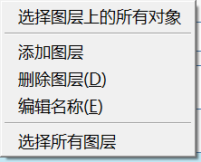

# Camadas

Use as camadas para controlar a visibilidade dos objetos do FormIt.

Consulte Camadas em ação ao seguir o [Manual do FormIt.](https://windows.help.formit.autodesk.com/building-the-farnsworth-house/control-visibility-with-layers)

## Criar e nomear camadas

No painel Camadas, é possível criar e nomear as camadas clicando no ícone “**+**”.

É possível clicar duas vezes no nome para renomear a camada ou alternar a visibilidade de seus objetos ao marcar e desmarcar a caixa esquerda. Use a caixa de seleção à direita para bloquear e desbloquear camadas. Uma camada bloqueada ainda estará visível, mas não poderá ser selecionada ou editável.

## Gerenciar objetos em camadas

Selecione objetos na tela e, em seguida, use o menu suspenso na parte superior do painel Camadas para indicar em qual camada os objetos selecionados devem ser colocados.

O FormIt não tem o conceito de “padrão” ou “camada de trabalho”. Toda a nova geometria será criada em “Nenhuma camada” e você precisará reatribuir os objetos às camadas após serem gerados.

É possível clicar com o botão direito do mouse em uma camada e escolher “Selecionar todos os objetos na camada” para selecionar toda a geometria atualmente atribuída a essa camada.

Também é possível reordenar as camadas no painel ao arrastar e soltá-las em uma nova posição. Observe que isso não tem impacto na visibilidade da geometria – essa é apenas uma ferramenta organizacional no painel.

