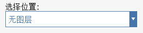

# Capas

Utilice Capas para controlar la visibilidad de los objetos de FormIt.

Vea las capas en acción en [FormIt Primer.](https://windows.help.formit.autodesk.com/building-the-farnsworth-house/control-visibility-with-layers)

## Creación y denominación de capas

En el panel Capas, puede hacer clic en el icono **+** para crear capas y asignarles nombres.

Puede hacer doble clic en el nombre de la capa para cambiarlo o activar o desactivar la visibilidad de sus objetos mediante la activación o la desactivación de la casilla de la izquierda. Utilice la casilla de verificación derecha para bloquear y desbloquear capas. Una capa bloqueada seguirá estando visible, pero no se podrá seleccionar ni editar.

## Administración de objetos en capas

Seleccione objetos en el lienzo y, a continuación, utilice el menú desplegable de la parte superior del panel Capas para indicar en qué capa se deben colocar los objetos seleccionados.

FormIt no reconoce el concepto de "capa por defecto" o "capa de trabajo". Toda la geometría nueva se creará en "No hay capas" y deberá volver a asignar objetos a capas después de generarlos.

Puede hacer clic con el botón derecho en una capa y elegir Seleccionar todo en capas para elegir toda la geometría asignada actualmente a esta capa.

También puede reordenar las capas en el panel. Para ello, arrástrelas y suéltelas en una nueva posición. Tenga en cuenta que esto no afecta a la visibilidad de la geometría; se trata de una herramienta de organización exclusiva del panel.

