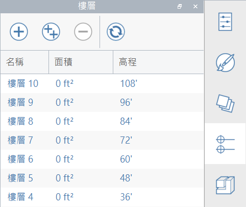
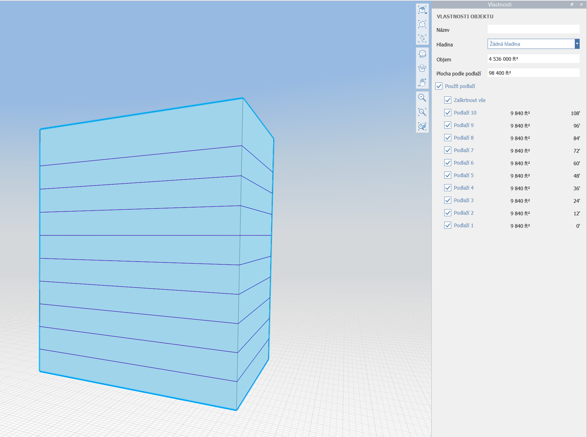

# Levels and Area

After creating geometry in FormIt, you can apply Levels to indicate where floor elevations are, and to generate area calculations.

Take a look at the [FormIt Primer ](../building-the-farnsworth-house/adding-floors-with-levels.md)to see Levels in action.

## Creating and Configuring Levels

You'll find the Levels panel on the right side of FormIt for Windows:

#### Create and Delete Levels

* Create a new Level by clicking the "+" button.
* Create a series of Levels by clicking the "++" button.
  * This will allow specifying how many Levels to create, and the vertical distance between them.
* Select one or more Levels and click "-" to delete them.

#### Rename, Set Elevations, and Renumber Levels

* Rename a Level by double-clicking on the name, or by right-clicking and choosing "Edit Name".
* Adjust a Level's elevation by double-clicking on the number, or by right-clicking and choosing "Edit Elevation".
* Click the Refresh icon at the top to renumber Levels.
  * This is useful if you've added or removed levels, and the default naming scheme is out of sync \(i.e. Level 1, Level 2, Level 5\).
  * This button will ignore any Levels with custom names, but will renumber any Levels with the name following the "Level 1" syntax.

## Applying Levels

To apply Levels to an object, you'll need to select the object and head over to the Properties panel. 

Note that to apply Levels to an object, the object must be solid, with no back face or watertight issues. [Learn how to check your model for watertight and back face issues](https://formit.autodesk.com/blog/post/repairing-solid-models).

With a solid object selected in the canvas \(in this example, a simple building shell\), the Properties panel will show a "Use Levels" checkbox.

* If the FormIt sketch already has Levels defined \(see above\), then checking this box will use all Levels that would intersect this shape \(ignoring any that would be too high or too low\).
* If the FormIt sketch does not have Levels already, checking this box will create enough default Levels.\(12' floor-to-floor height\) to intersect the entire shape, and will automatically apply those Levels to this object.

## Levels + Revit

When Levels are applied to FormIt geometry, those Levels will be sent to Revit when using the [FormIt Add-In](https://formit.autodesk.com/page/formit-revit). 

In Revit, you can use the FormIt levels to create Mass floors, Floor by Face, and floor plans associated with the FormIt Levels.

