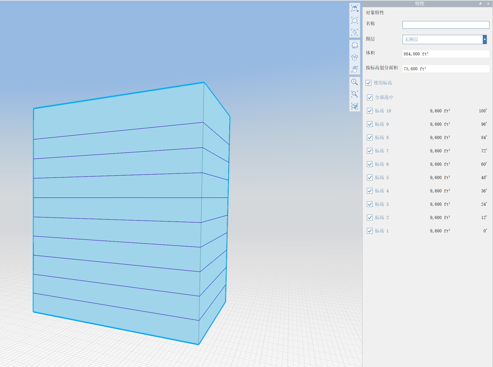

# 樓層和面積

在 FormIt 中建立幾何圖形後，您可以套用樓層以指出樓板高程的位置，並產生面積計算。

請查看 [FormIt 入門手冊](../formit-primer/part-i/adding-floors-with-levels.md)，以查看實際使用中的樓層。

## 建立和規劃樓層

您會在 Windows 版 FormIt 的右側找到「樓層」面板：

#### 建立和刪除樓層

* 按一下「+」按鈕可建立新樓層。
* 按一下「++」按鈕可建立一系列樓層。
   * 這允許指定要建立的樓層數，以及樓層之間的垂直距離。
* 選取一個或多個樓層，然後按一下「-」可刪除它們。

#### 更名、設定高程和對樓層重新編號

* 按兩下樓層名稱，或按一下右鍵並選擇「編輯名稱」，可更名樓層。
* 按兩下數字，或按一下右鍵並選擇「編輯高程」，可調整樓層的高程。
* 按一下頂端的「重新整理」圖示可對樓層重新編號。
   * 如果您已加入或移除樓層，但預設的命名規則不同步 \(例如「樓層 1」、「樓層 2」、「樓層 5」\)，則此功能非常有用。
   * 此按鈕將忽略任何具有自訂名稱的樓層，但會以依循「樓層 1」語法的名稱對任何樓層重新編號。

## 套用樓層

若要對物件套用樓層，您必須選取物件並移至「性質」面板。

請注意，若要對物件套用樓層，該物件必須是實體，且沒有背面或防水問題。[瞭解如何檢查模型是否有防水和背面問題](https://formit.autodesk.com/blog/post/repairing-solid-models)。

在圖元區中選取實體物件 \(在此範例中是簡單的建築殼體\) 後，「性質」面板會顯示「使用樓層」勾選方塊。

* 如果 FormIt 草圖已定義樓層 \(請參閱上文\)，則勾選此方塊將使用與此造型相交的所有樓層 \(忽略任何可能過高或過低的樓層\)。
* 如果 FormIt 草圖還沒有樓層，勾選此方塊將建立足夠的預設樓層 \(樓板到樓板的高度為 12'\) 以便與整個造型相交，並且會自動對此物件套用這些樓層。

## 樓層 + Revit

對 FormIt 幾何圖形套用樓層時，如果使用 [FormIt 增益集](https://formit.autodesk.com/page/formit-revit)，這些樓層將傳送至 Revit。

在 Revit 中，您可以使用 FormIt 樓層來建立量體樓板、依面建立樓板，以及與 FormIt 樓層關聯的樓板平面圖。

