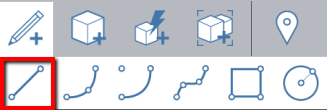
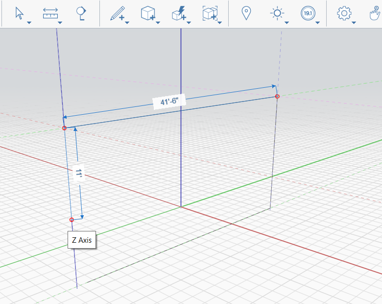

# Lignes

Utilisez des lignes pour diviser des faces et construire une géométrie.

Clavier : L

Vous pouvez tracer des lignes sur l’axe X, Y ou Z, ainsi que sur une géométrie existante. Lorsque vous effectuez un accrochage à un axe, une ligne colorée s’étend au-delà de la ligne que vous dessinez, indiquant l’axe sur lequel vous dessinez. La longueur de la ligne s’affiche pendant que vous dessinez. Pour entrer manuellement une longueur spécifique, appuyez sur la touche **TAB** et saisissez une valeur.

Couleurs de ligne par axe :

Pour spécifier une longueur, il vous suffit de saisir une valeur de cote. Une boîte de dialogue Modifier la cote s’affiche. Cliquez sur OK ou appuyez sur Entrée pour accepter la valeur.

* X = rouge
* Y = vert
* Z = bleu

