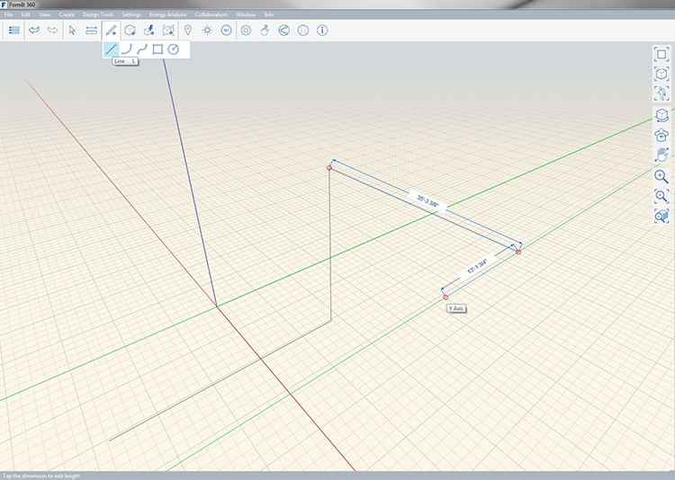

### Line Tool

---
> Draw a lines to divide faces and construct geometry.

---

A line can be draw on all the X, Y and Z axis and also on existing geometry. When you're snapped to an axis a colored line will extend beyond the line you are drawing. You can see the length of the line as you draw; to manually a specfic length press **tab** and enter that length. 

- X = Red
- y = Green
- Z = Blue

You can see the length of the line as you draw; to manually specify a length press **tab**. 

