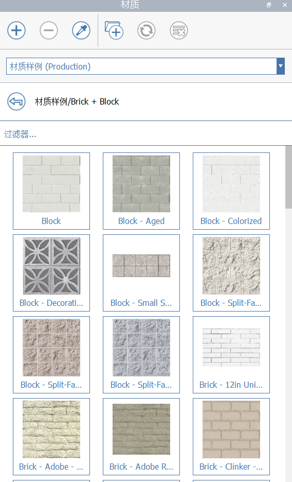

# 재질

반사, 광택 및 범프 맵을 지원하는 재료를 사용하여 FormIt 모델을 멋지게 만들 수 있습니다.

## 재료 패널

.png>)

재료 패널에서는 다양한 재료 샘플 중에서 선택하고, 연결된 재료 라이브러리 간을 탐색하고, FormIt 2021부터는 다른 FormIt(.AXM) 파일의 재료 컨텐츠에 액세스하여 해당 컨텐츠를 사용할 수 있습니다.

### 재료 라이브러리 소스

FormIt 2021 이상에서는 재료 패널에 사용 가능한 재료 라이브러리 소스(In-Sketch, 재료 샘플 및 [링크된 라이브러리](https://windows.help.formit.autodesk.com/tool-library/materials#linking-material-libraries)) 중에서 선택할 수 있는 드롭다운 인터페이스가 있습니다.

.png>)

#### 스케치에서

현재 FormIt 스케치에 대해 저장된 재료를 표시합니다.

#### 재료 샘플

사용 가능한 샘플 재료 목록을 표시합니다. 이러한 항목은 클라우드 기반 서버에 저장되므로 다음 사항에 유의하십시오.

* 재료 샘플 카테고리에 처음 액세스하는 경우 인터넷 연결이 필요합니다.
* 카테고리에 처음 액세스하는 경우 카테고리가 다운로드된 다음 컴퓨터에 캐시되므로 이후 세션에서는 다운로드할 필요가 없습니다.
* FormIt 팀이 때때로 재료 샘플의 제품을 업데이트할 수 있습니다. 이 경우 FormIt은 카테고리를 자동으로 삭제하고 다시 다운로드하여 최신 상태를 유지합니다.

**링크된 라이브러리**

[재료 라이브러리를 링크](https://windows.help.formit.autodesk.com/tool-library/materials#linking-material-libraries)하면 다른 디렉토리 및 위치가 나타납니다.

### 작성, 삭제 및 스포이드

색상, 텍스처, 범프 맵, 절단부 맵, 투명도 및 반사/광택 설정을 정의하여 **새 재료를 작성**합니다.

 (1).PNG>) 선택한 재료를 **삭제**합니다.

장면에 페인트된 재료를 **스포이드**한 다음 즉시 해당 재료로 페인트를 시작합니다.

* 스포이드 도구를 클릭한 후 재료로 페인트된 면을 클릭합니다.
* 면에 있는 재료가 패널에서 강조 표시되고 해당 재료가 로드된 상태로 페인트 브러시 도구가 활성화됩니다.

### 새로 고침, 라이브러리 링크 및 사용되지 않은 항목 소거

\*\*\*\*로컬 디렉토리에서**재료 라이브러리를 링크**합니다. JPG, PNG 또는 AXM(FormIt) 파일이 포함된 디렉토리에 컨텐츠가 표시됩니다. 자세한 내용은 [재료 라이브러리 링크](https://windows.help.formit.autodesk.com/tool-library/materials#linking-material-libraries)를 참조하십시오.

현재 디렉토리를 **새로 고침**합니다. 로컬로 링크된 디렉토리를 볼 때만 활성화됩니다(스케치에서 또는 재료 샘플에서는 사용할 수 없음).

현재 FormIt 스케치에서  **사용하지 않는 재료를 소거**합니다.

사용하지 않는 재료는 반복 과정을 통해 자연스럽게 누적될 수 있지만 고품질 텍스처를 사용하는 경우 파일 크기에 상당한 영향을 미칠 수 있습니다.

사용하지 않는 재료는 스케치에서 목록에 회색으로 표시된 이름으로 나타납니다.

사용하지 않는 모든 재료를 삭제하려면 사용되지 않은 항목 소거 도구를 클릭합니다. 먼저 삭제 여부를 묻는 메시지가 표시되므로 한 번 더 생각해 보고 취소할 수 있습니다. 이 버튼은 스케치에서 목록에서만 사용할 수 있습니다.

### 재료 라이브러리 링크

FormIt 2021 이상 버전에서는 재료 패널을 JPG, PNG 및/또는 FormIt 파일의 폴더를 포함하여 재료 컨텐츠가 포함된 로컬 디렉토리(라이브러리)에 링크하는 기능을 제공합니다.

* **JPG/PNG 파일**은 현재 FormIt 스케치에 직접 페인트할 수 있는 재료로 표시됩니다.
   * 썸네일을 클릭하면 이미지 파일이 즉시 FormIt 재료로 변환되고 현재 스케치에 복사됩니다.
   * FormIt이 '스케치에서' 디렉토리로 돌아가 방금 스케치에 복사한 재료를 봅니다.
* **FormIt 파일(\*.axm)**이 FormIt 아이콘이 있는 폴더로 표시됩니다.
   * FormIt 파일 폴더를 클릭하면 해당 파일에 저장된 모든 FormIt 재료가 표시됩니다.
   * FormIt은 재료 컨텐츠를 가져오기 위해 파일의 일부를 로드해야 하므로 파일이 클수록 패널에 재료를 표시하는 데 시간이 오래 걸릴 수 있습니다.

### 재료 상호 작용

썸네일을 한 번 클릭하여 **재료를 페인트**합니다. 페인트 브러시 도구에 배치되며, FormIt 캔버스에서 형상 위에 마우스를 놓고 면 또는 그룹을 클릭하여 페인트할 수 있습니다.

페인트 브러시 도구를 사용한 후 다음을 수행합니다.

* 한 번 클릭하여 여러 면 및 그룹을 페인트합니다.
   * 그룹을 페인트할 때 재료는 중첩된 형상으로 계단식 배열되며 기본 재료로 페인트된 표면 또는 그룹을 덮습니다.
* 면을 두 번 클릭하여 부착된 모든 항목을 선택해 전체 솔리드를 페인트합니다.

면과 그룹을 먼저 선택한 다음 재료 썸네일을 한 번 클릭하여 해당 재료로 선택 항목을 페인트할 수도 있습니다.

**썸네일을 두 번 클릭하여 재료를 편집**합니다. 그러면 재료 편집기가 나타납니다(아래 참조).

이름을 두 번 클릭하여 **재료의 이름을 바꿉니다**.

형상을 선택하고 선택한 형상에서 페인트된 재료를 나타내는 강조 표시 및 아이콘을 찾아 **재료를 식별**합니다.

**기본 재료**를 사용하여 면 또는 재료 그룹을 효과적으로 '지울' 수 있습니다. 재료로 페인트되지 않은 형상은 기본 재료로 암시적으로 페인트됩니다.

### 목록 관리

기둥 폭을 조정하여 썸네일 크기를 조정합니다('재료' 오른쪽으로 수직선을 클릭하여 끌기).

'필터...' 막대에 입력하여 특정 재료를 필터링합니다.

이름이 회색 글꼴로 표시된 재료는 현재 스케치에서 사용하지 않는 재료를 나타냅니다.

## 재료 작성 및 편집

.png>)

재료를 만들거나 편집하면 재료 편집기 대화상자가 표시되며, 여기서 다음 항목을 사용자화할 수 있습니다.

* **색상**
* **이미지 맵**
   * 썸네일을 클릭하여 새 맵을 선택합니다.
   * 다른 응용프로그램에서 편집하기 위해 지도를 저장하려면 저장 아이콘을 클릭합니다.
   * 삭제 아이콘을 클릭하여 이 재료에서 맵을 삭제합니다.
      * **이미지 파일의 텍스처**
         * JPG 또는 PNG
      * **이미지 파일의 범프 맵**
         * JPG 권장
         * 재료에 깊이 효과를 추가하는 데 유용합니다.
         * ShaderMap과 같은 프리웨어를 사용하여 텍스처가 지정된 범프 맵을 생성할 수 있습니다.
      * **이미지 파일의 절단부분 맵**
         * PNG
         * 체인 링크 울타리 또는 관통 패널과 같은 선택적 투명도가 있는 재료에 적합합니다.
* **이름**
* **수평 및 수직 축척**
   * 사용하도록 설정하면 잠금 모양 버튼은 수평 및 수직 축척이 텍스처의 종횡비를 따르도록 합니다.
   * 수직 축척과 독립적으로 수평 축척을 조정하여 재료를 늘립니다.
   * 재료 배치 조정 도구를 사용하여 면마다 수평 및 수직 축척을 재지정할 수 있습니다(아래 참조).
* **투명도**, **반사** 및 **광택**

## 재료 배치 조정

면에 재료를 페인트할 때 FormIt은 최상의 방향을 추측합니다.

* 수직 면은 텍스처의 위쪽 방향이 Z축을 따르도록 방향이 지정됩니다.
* 수평 면은 면의 가장 긴 면을 따라 텍스처 방향을 세로로 지정합니다.

**재료 배치 조정** 도구를 사용하여 기본 재료 배치와 특정 면의 재료 축척을 재지정합니다.

* 재료로 페인트된 면을 하나 또는 그 이상 선택합니다.
   * 면이 상위 그룹의 재료를 상속하는 경우 먼저 면을 직접 페인트해야 합니다.
* 바로 가기 MP 또는 마우스 오른쪽 버튼을 클릭하면 표시되는 상황에 맞는 메뉴를 통해 재료 배치 조정 도구에 액세스합니다.

화면상의 컨트롤을 사용하여 면에서 직접 대화식으로 재료 텍스처를 이동, 회전 및 축척합니다.

재료 배치에 대한 변경 사항을 재설정하려면 재료 패널에서 원래 재료로 면을 다시 페인트하기만 하면 됩니다.

## Revit으로 재료 변환

Revit 2018 이상용 [FormIt 애드인](https://formit.autodesk.com/page/formit-revit)을 사용할 때 재료가 Revit으로 전송됩니다.
