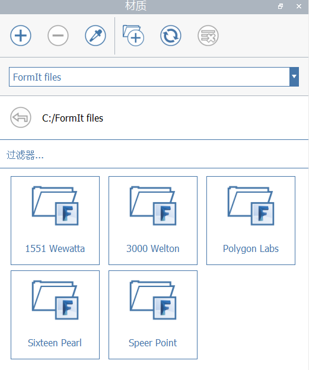

# Materials

Możesz uatrakcyjnić modele programu FormIt, używając materiałów z odbiciami, połyskiem i mapami wypukłości.

## Panel Materiały

.png>)

W panelu Materiały możesz wybrać jeden z wielu materiałów przykładowych, przechodzić między połączonymi bibliotekami materiałów oraz, od wersji FormIt 2021, uzyskiwać dostęp do materiałów z innych plików programu FormIt (AXM) i używać ich.

### Źródła bibliotek materiałów

W programie FormIt 2021 i nowszych wersjach panel Materiały zawiera interfejs rozwijany, za pomocą którego można wybrać dostępne źródła bibliotek materiałów: W szkicu, Przykłady materiałów i [połączone biblioteki](https://windows.help.formit.autodesk.com/tool-library/materials#linking-material-libraries).

.png>)

#### W szkicu

Pokazuje materiały zapisane w bieżącym szkicu programu FormIt.

#### Przykłady materiałów

Wyświetla listę dostępnych materiałów przykładowych. Te oferty są przechowywane na serwerze w chmurze, dlatego należy pamiętać o następujących kwestiach:

* Podczas uzyskiwania dostępu do kategorii przykładów materiałów po raz pierwszy wymagane jest połączenie z Internetem.
* Podczas uzyskiwania dostępu do kategorii po raz pierwszy zostanie ona pobrana, a następnie zapisana w pamięci podręcznej komputera, dzięki czemu podczas kolejnych sesji nie będzie wymagane pobieranie.
* Zespół programu FormIt może czasami aktualizować oferty w bibliotece Przykłady materiałów. W takim przypadku odpowiednie kategorie zostaną automatycznie usunięte w programie FormIt i zostaną pobrane najnowsze wersje.

**Połączone biblioteki**

Inne katalogi i położenia będą widoczne po [połączeniu bibliotek materiałów](https://windows.help.formit.autodesk.com/tool-library/materials#linking-material-libraries).

### Tworzenie, usuwanie i zakraplacz

 **Tworzenie nowego materiału** — możesz zdefiniować jego kolor, teksturę, mapę wypukłości, mapę wycięć, przezroczystość oraz ustawienia odbicia/połysku.

 (1).PNG>) **Usuń** wybrane materiały.

 **Kroplomierz** pozwala wybrać materiał, którym pomalowany jest element sceny, i zacząć malować tym materiałem.

* Kliknij narzędzie Kroplomierz, a następnie kliknij powierzchnię pomalowaną materiałem.
* Materiał znaleziony na powierzchni zostanie wyróżniony w panelu i zostanie uruchomione narzędzie Pędzel z wczytanym materiałem.

### Odświeżanie, łączenie bibliotek i usuwanie nieużywanych

\*\*\*\* **Łączenie bibliotek materiałów** z katalogów lokalnych. Elementy będą widoczne w katalogach zawierających pliki JPG, PNG lub AXM (pliki programu FormIt). Aby uzyskać więcej informacji, zobacz temat [Łączenie bibliotek materiałów](https://windows.help.formit.autodesk.com/tool-library/materials#linking-material-libraries).

 **Odświeżenie** bieżącego katalogu. Ta opcja jest dostępna tylko podczas wyświetlania katalogu połączonego lokalnie (nie w przypadku bibliotek W szkicu i Przykłady materiałów).

 **Usunięcie nieużywanych** materiałów z bieżącego szkicu programu FormIt.

W procesie iteracji z czasem w naturalny sposób gromadzą się nieużywane materiały, które mogą znacznie zwiększyć rozmiar pliku, jeśli zawierają tekstury wysokiej jakości.

Nazwy nieużywanych materiałów są wyświetlane na szaro na liście W szkicu.

Kliknij narzędzie Usuń nieużywane, aby usunąć wszystkie nieużywane materiały. Najpierw zostanie wyświetlony monit umożliwiający anulowanie operacji, jeśli zmienisz zdanie. Ten przycisk jest dostępny tylko na liście W szkicu.

### Łączenie bibliotek materiałów

W programie FormIt 2021 i nowszych wersjach można połączyć panel Materiały z katalogami lokalnymi (bibliotekami) zawierającymi elementy materiałów, na przykład z folderami zawierającymi pliki JPG, PNG i/lub pliki programu FormIt:

* **Pliki JPG/PNG** będą wyświetlane jako materiały, którymi można malować bezpośrednio w bieżącym szkicu programu FormIt.
   * Kliknięcie miniatury spowoduje automatyczne przekształcenie pliku obrazu w materiał programu FormIt i skopiowanie go do bieżącego szkicu.
   * W programie FormIt zostanie ponownie wyświetlony katalog „W szkicu”, z widocznym materiałem nowo skopiowanym do szkicu.
* **Pliki programu FormIt (\*.axm)** będą wyświetlane jako foldery z ikoną FormIt.
   * Kliknięcie folderu pliku programu FormIt spowoduje wyświetlenie wszystkich materiałów programu FormIt zapisanych w tym pliku.
   * Pamiętaj, że w celu pobrania elementów materiału wymagane jest wczytanie części pliku w programie FormIt, a więc wyświetlenie materiałów w panelu może potrwać dłużej w przypadku większych plików.

### Interakcje materiałów

**Możesz malować materiałem**, klikając jeden raz jego miniaturę. Zostanie włączone narzędzie Pędzel, a po umieszczeniu kursora na geometrii w obszarze rysunku programu FormIt będzie można kliknąć powierzchnie lub grupy, aby je pomalować.

Po włączeniu narzędzia Pędzel:

* Aby malować powierzchnie i grupy, kliknij je pojedynczo.
   * Podczas malowania grup materiał zostanie zastosowany w geometrii zagnieżdżonej kaskadowo i pokryje każdą powierzchnię lub grupę pomalowaną przy użyciu materiału domyślnego.
* Aby malować całe bryły, kliknij dwukrotnie powierzchnię w celu wybrania wszystkich dołączonych elementów.

Możesz też najpierw wybrać powierzchnie i grupy, a następnie kliknąć jeden raz miniaturę materiału, aby pomalować wybrane elementy tym materiałem.

**Aby edytować materiał**, kliknij dwukrotnie jego miniaturę, co spowoduje wyświetlenie Edytora materiałów (patrz poniżej).

**Aby zmienić nazwę materiału**, kliknij dwukrotnie nazwę.

**Aby zidentyfikować materiał**, którym pomalowano geometrię, wybierz ją i poszukaj wyróżnienia oraz ikony — będą one wskazywać materiał lub materiały, którymi pomalowano wybraną geometrię.

**Materiał domyślny** umożliwia w praktyce „wyczyszczenie” powierzchni lub grupy z wszelkich materiałów. Każda geometria, która nie jest pomalowana przy użyciu materiału, jest domyślnie pomalowana przy użyciu materiału domyślnego.

### Zarządzanie listami

Aby dopasować rozmiar miniatur, zmień szerokość kolumny (kliknij i przeciągnij linię pionową po prawej stronie nagłówka „Materiał”).

Aby filtrować listę pod kątem określonych materiałów, wpisz tekst na pasku „Filtruj…”.

Nazwy materiałów wyświetlane na szaro wskazują, że te materiały nie są używane w bieżącym szkicu.

## Tworzenie i edycja materiałów

.png>)

Podczas tworzenia lub edycji materiału zostanie wyświetlone okno dialogowe Edytor materiałów, w którym można dostosować następujące ustawienia:

* **Kolor**
* **Mapy obrazu**
   * Kliknij miniaturę, aby wybrać nową mapę.
   * Kliknij ikonę Zapisz, aby zapisać mapę do edycji w innej aplikacji.
   * Kliknij ikonę Usuń, aby usunąć mapę z tego materiału.
      * **Tekstura z pliku obrazu**
         * JPG lub PNG
      * **Mapa wypukłości z pliku obrazu**
         * Zalecany format JPG.
         * Praktyczne rozwiązanie do dodawania efektu głębi do materiałów.
         * Aby wygenerować mapy wypukłości na podstawie tekstury, można użyć bezpłatnego oprogramowania, takiego jak ShaderMap.
      * **Mapa wycięć z pliku obrazu**
         * PNG
         * Praktyczne rozwiązanie w przypadku materiałów, które mają selektywną przezroczystość, takich jak ogrodzenia z siatki czy panele perforowane.
* **Nazwa**
* **Skala pozioma i pionowa**
   * Przycisk Zablokuj proporcje po włączeniu zapewnia, że skala pozioma i pionowa będzie zgodna ze współczynnikiem proporcji tekstury.
   * Aby rozciągnąć materiał, dostosuj skalę poziomą niezależnie od skali pionowej.
   * Skalę poziomą i pionową wybranych powierzchni można nadpisać za pomocą narzędzia Dopasuj położenie materiału (patrz poniżej).
* **Przezroczystość**, **odbicie** i **połysk**

## Dopasowywanie położenia materiału

Podczas malowania powierzchni przy użyciu materiału program FormIt automatycznie określa najlepszą orientację:

* W przypadku powierzchni pionowych górna część tekstury zostanie ustawiona wzdłuż osi Z.
* W przypadku powierzchni poziomych tekstura zostanie ustawiona wzdłuż najdłuższego boku powierzchni.

Za pomocą narzędzia **Dopasuj położenie materiału** można nadpisać domyślne położenie materiału oraz jego skalę na wybranych powierzchniach:

* Wybierz powierzchnię lub powierzchnie pomalowane materiałem.
   * Jeśli powierzchnia dziedziczy materiał z grupy nadrzędnej, należy najpierw bezpośrednio pomalować powierzchnię.
* Przejdź do narzędzia Dopasuj położenie materiału za pomocą skrótu MP lub przy użyciu menu kontekstowego dostępnego po kliknięciu prawym przyciskiem myszy:

Użyj kontrolek na ekranie, aby w sposób interaktywny przesuwać, obracać i skalować tekstury materiału bezpośrednio na powierzchni:

Aby zresetować wszystkie zmiany wprowadzone w położeniu materiału, wystarczy ponownie pomalować powierzchnię pierwotnym materiałem z panelu Materiały.

## Przekształcanie materiałów dla programu Revit

Materiały można przekazać do programu Revit za pomocą [dodatku FormIt](https://formit.autodesk.com/page/formit-revit) dla programu Revit 2018 lub nowszego.
