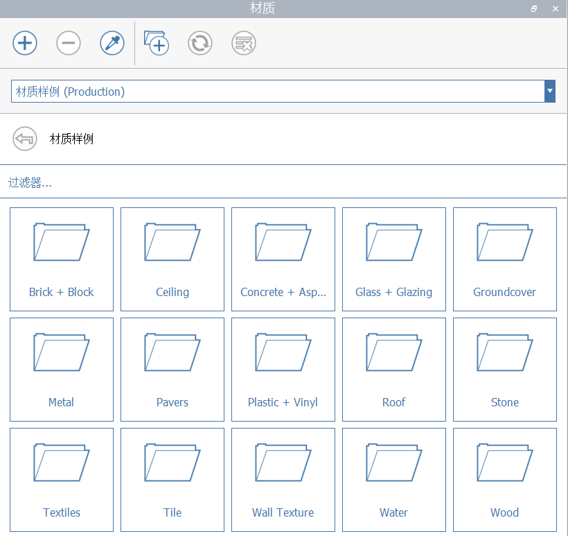

# Materials

Make your FormIt models pop with Materials that support reflection, gloss, and bump maps.

## The Materials Panel

In the materials panel, you can choose from a wide variety of Material Samples, navigate between linked Material libraries, and, as of FormIt 2021, access and use the Material contents of other FormIt \(.AXM\) files.

### Material Library Sources

In FormIt 2021 and newer, the Materials panel has a drop-down interface to choose from available Material Library sources: In-Sketch, Material Samples, and [linked libraries](https://windows.help.formit.autodesk.com/tool-library/materials#linking-material-libraries).

#### In Sketch

Shows the Materials saved to the current FormIt sketch.

#### Material Samples

Shows a list of available sample Materials. These offerings are stored on a cloud-based server, so please note:

* An internet connection is required when accessing Material Samples categories for the first time.
* When accessing a category for the first time, it will be downloaded and then cached on your computer, so that future sessions won't require a download. 
* The FormIt team may occasionally update the offerings in Material Samples. When that happens, FormIt will automatically delete and re-download the categories to get the latest. 

**Linked Libraries**

Other directories and locations will appear after [linking Material libraries](https://windows.help.formit.autodesk.com/tool-library/materials#linking-material-libraries).

### Create, Delete, and Eyedropper

 **Create a new Material** by defining its color, texture, bump map, cutout map, transparency, and reflection/gloss settings.

 **Delete** selected Material\(s\).

 **Eyedropper** a Material painted in the scene, and immediately start painting with it.

* Click the Eyedropper tool, then click a face painted with a Material
* The material that's found on the face will be highlighted in the panel, and the Paintbrush tool will become active with that Material loaded.

### Refresh, Link Libraries, and Purge Unused

\*\*\*\* **Link Material libraries** from local directories. Directories containing JPG, PNG, or AXM \(FormIt\) files will display content. See [Linking Material Libraries](https://windows.help.formit.autodesk.com/tool-library/materials#linking-material-libraries) for more information.

**Refresh** the current directory. Only enabled when viewing a locally-linked directory \(not In Sketch or Material Samples\).

 **Purged unused** Materials from the current FormIt sketch.

Unused Materials can accumulate naturally through the process of iteration, but they can add significantly to the file size if they use high-quality textures.

Unused Materials appear with a grey-colored name in the In Sketch list.

Click the Purge Unused tool to delete all unused Materials. You'll see a prompt first, so you can cancel if you have second thoughts. This button is only enabled in the In Sketch list.

### Linking Material Libraries

FormIt 2021 and newer offers the ability to link the Materials panel to local directories \(libraries\) containing Material content, including folders of JPGs, PNGs, and/or FormIt files:

* **JPG/PNG files** will display as Materials, which can be painted directly into the current FormIt sketch.
  * Clicking on a thumbnail converts the image file to a FormIt Material on the fly, and copies it to the current sketch. 
  * FormIt will return you to the "In Sketch" directory to see the Material you've just copied to the sketch.
* **FormIt files \(\*.axm\)** will display as folders with a FormIt icon. 
  * Clicking on the FormIt file folders will display all FormIt Materials saved to that file.
  * Note that FormIt must load part of the file to get the Material contents, so larger files may take longer to display Materials in the panel.

### Material Interactions

**Paint a Material** by single-clicking clicking the thumbnail. You'll be placed into the Paintbrush tool, where you can now hover over geometry in the FormIt canvas and click faces or Groups to paint them.

Once you're in the Paintbrush tool:

* Paint faces and Groups by single-clicking.
  * When painting Groups, the Material will cascade into the nested geometry and will cover any surface or Group painted with the Default Material.
* Paint entire solids by double-clicking a face to select everything attached.

You can also select faces and Groups first, then single-click a Material thumbnail to paint the selection with that Material.

**Edit a Material** by double-clicking on the thumbnail, which will bring up the Material Editor \(see below\).

**Rename a Material** by double-clicking the name.

**Identify a Material** painted on geometry by selecting it, and looking for the highlight and icon indicating what Material\(s\) are painted on the selected geometry.

**The Default Material** can be used to effectively "clear" a face or a Group of any Materials. Any geometry not painted with a Material is implicitly painted with the Default Material.

### List Management

Adjust the size of the thumbnails by adjusting the width of the column \(click and drag the vertical line to the right of "Material"\).

Filter for specific Materials by typing in the "Filter..." bar.

Materials with names that display in a grey font indicate that those Materials that are not used in the current sketch.

## Create and Edit Materials

When you create or edit a Material, you'll see the Material Editor dialog, where you can customize:

* **Color**
* **Image Maps**
  * Click the thumbnail to choose a new map.
  * Click the Save icon to save the map for editing in another application.
  * Click the Delete icon to delete the map from this material.
    * **Texture from an image file**
      * JPG or PNG
    * **Bump map from an image file**
      * JPG recommended
      * Great for adding depth effects to Materials.
      * You can use freeware like ShaderMap to generate bump maps given a texture.
    * **Cutout map from an image file**
      * PNG
      * Great for Materials that have selective transparency, like chainlink fences or perforated panels.
* **Name**
* **Horizontal and Vertical Scale**
  * When enabled, the Lock Aspect button will ensure the horizontal and vertical scale respect the texture's aspect ratio. 
  * Stretch a Material by adjusting horizontal scale independently from vertical scale.
  * You can override the horizontal and vertical scale per-face using the Adjust Material Placement tool \(see below\).
* **Transparency**, **Reflection**, and **Gloss**

## Adjusting Material Placement

When painting a Material on a face, FormIt takes a best guess as to the best orientation:

* Vertical faces will orient with the texture's top oriented along the Z-axis.
* Horizontal faces will orient the texture lengthwise along the longest side of the face.

Use the **Adjust Material Placement** tool to override the default Material placement, as well as the Material's scale on specific faces:

* Select a face or faces painted with a Material
  * If the face is inheriting its Material from its parent Group, you'll need to paint the face directly first.
* Access the Adjust Material Placement tool through the shortcut MP or from the right-click context menu:

Use the on-screen controls to interactively move, rotate and scale the material textures directly on the face:

To reset any of the changes to the material placement, simply paint the face again with the original material, from the Materials panel.

## Material Translation to Revit

Materials will transfer to Revit when using the [FormIt Add-In](https://formit.autodesk.com/page/formit-revit) for Revit 2018 or later.

