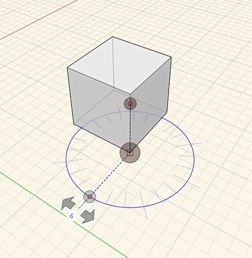
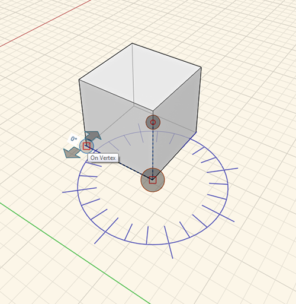

### Measure Angle Tool

---
> The measure angle tool is located on the [Action Tool Bar](../formit-introduction/tool-bars.md).

---

The measure angel tool is used to measure angles between vertices, edges, faces, and volumes. You can also use the measure to drive drive dimensions of geometry.

- Select measure tool from the Action Tool Bar or short key **M A** and and select starting point.

- Click and drag handle to the starting vertex.

- Use arrows to measure the angle between one point to another. 

- To change the geometry click on face/edge to change and enter a new angle by clicking on the provided angle. 

- **Final Result:**
