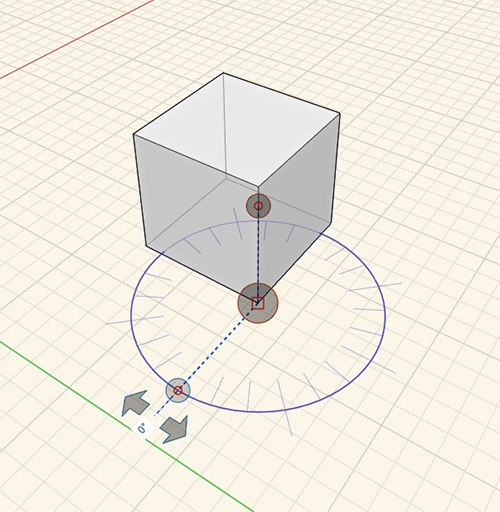
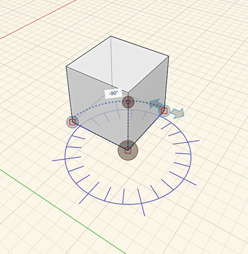
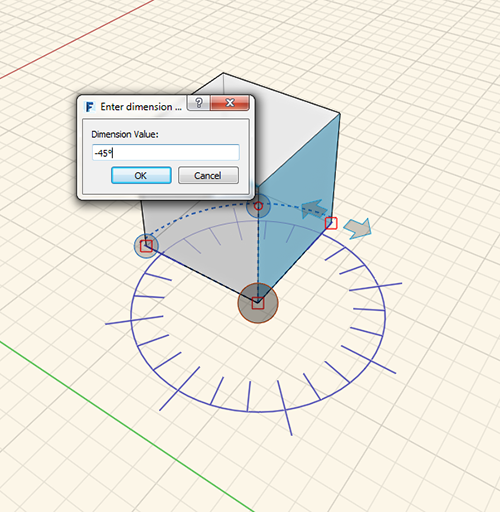
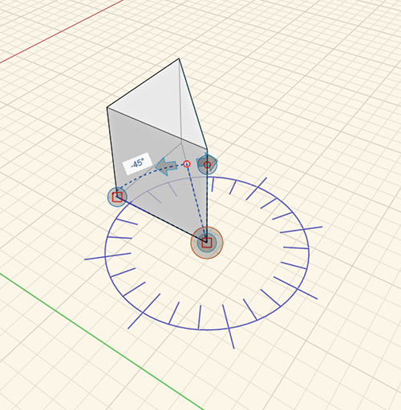

# Measure Angle

The Measure Angle tool is located on the [Tool Bar](../formit-introduction/tool-bars.md).

The Measure Angle tool is used to measure angles between vertices, edges, faces, and volumes. You can also use the Measure Angle tool to drive dimensions of geometry.

* From the **Measure** toolbar menu, select the **Measure Angle** tool or use the keyboard shortcut **M A** and select a starting point.

  

* Click and drag the handle to the starting vertex.

  

* Use the arrows to measure the angle between one point to another.

  

* To change the geometry, click on an edge or face and enter a new angle value by clicking on the displayed angle.

  

* Your changes or measurements display:

  

