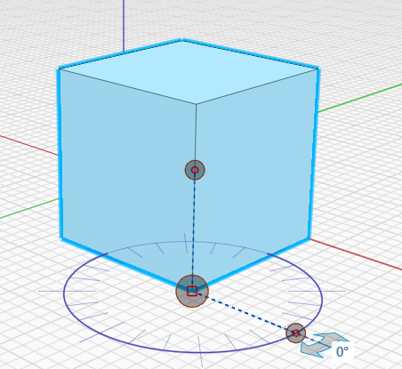
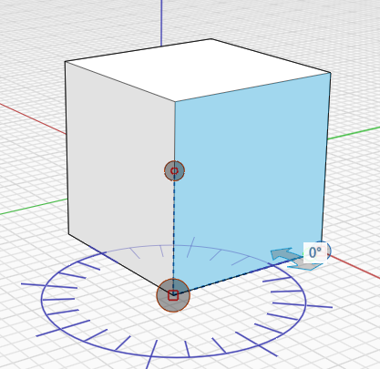
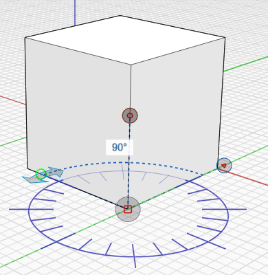
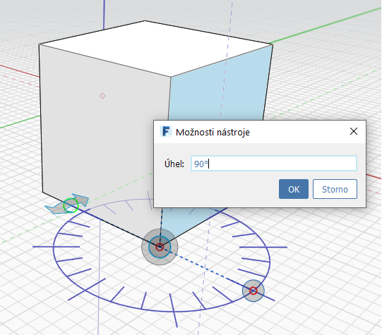
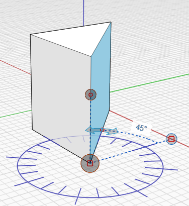

# Измерение угла

Инструмент «Измерить угол» находится на [панели инструментов](../formit-introduction/tool-bars.md).

Он используется для измерения углов между вершинами, ребрами, гранями и объемами. Его также можно использовать для определения размеров геометрии.

* В меню панели инструментов **Измерение** выберите инструмент **Измерить угол** или используйте комбинацию клавиш **M+A** и выберите начальную точку.

   

* Щелкните и перетащите ручку в место начальной вершины.

   

* Используйте стрелки для измерения угла между двумя точками.

   

* Чтобы изменить геометрию, щелкните ребро или грань и введите новое значение угла, щелкнув отображаемый угол.

   

* Отобразятся внесенные изменения или измерения.

   

