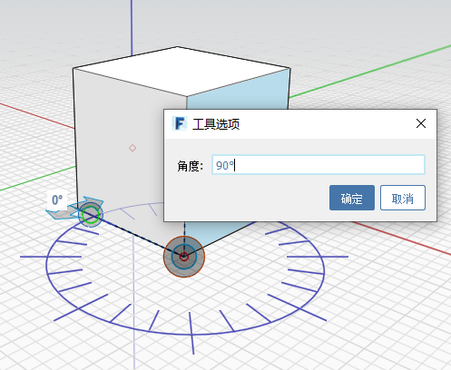

# 角度を計測する

[角度を計測]ツールは、[ツールバー](../formit-introduction/tool-bars.md)にあります。

[角度を計測]ツールを使用して、頂点、エッジ、面、体積間の角度を計測します。また、ジオメトリの寸法を調整することもできます。

* **[計測]**ツールバー メニューから**[角度を計測]**ツールを選択するか、キーボード ショートカットの **MA** を使用して、始点を選択します。

   

* ハンドルをクリックして、開始位置の頂点までドラッグします。

   

* 矢印を使用して、点と点の間の角度を計測します。

   

* ジオメトリを変更するには、エッジまたは面をクリックし、表示された角度をクリックして新しい角度値を入力します。

   

* 変更した角度値に合わせてジオメトリが変化します。

   

