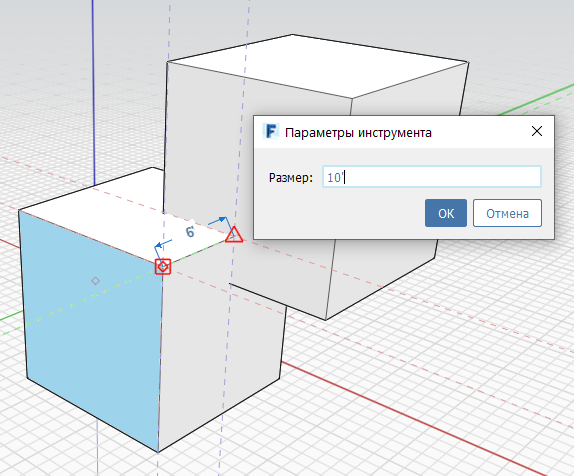
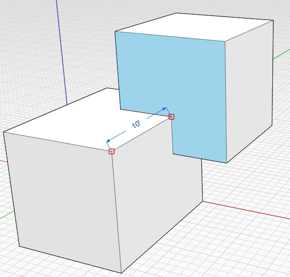

# 测量

**“测量”**工具位于[“工具栏”](../formit-introduction/tool-bars.md)上。

可以使用**“测量”**工具测量模型中的现有几何图形。还可以使用**“测量”**工具为几何图形指定尺寸。

1. 选择**“测量”**工具。
2. 选择两个点来测量它们之间的距离。
3. 选择要调整的面或边、单击显示的值，然后在将显示的对话框中添加新值。

  
  

