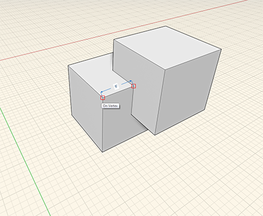
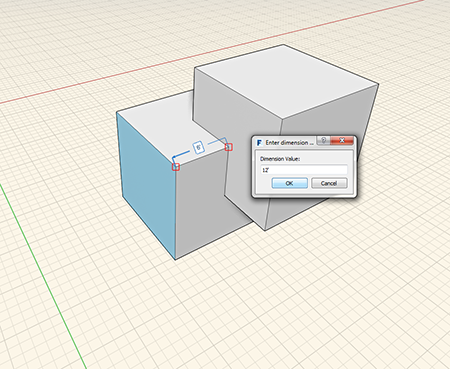
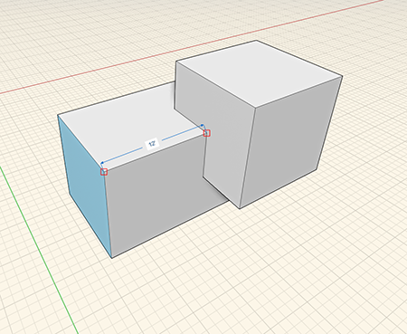

### Measure Tool

---
> The measure tool is located on the [Action Tool Bar](../formit-introduction/tool-bars.md).

---

The measure tool is used to measure geometry that has been previously modeled. You can also use the measure to drive drive dimensions of geometry.

1. Select the measure tool and measure between two points.
2. Select face or edge you want to change the length of then click the number and imput a new length.

