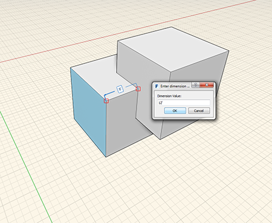
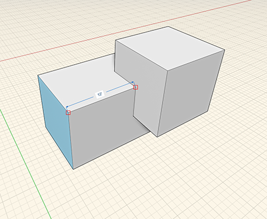

# Measure

The **Measure** tool is located on the [Tool Bar](../formit-introduction/tool-bars.md).

You can use the **Measure** tool to measure existing geometry in a model. You can also use the **Measure** tool to assign dimensions to geometry.

1. Select the **Measure** tool.
2. Select two points to measure the distance between them.
3. Select a face or edge you want to adjust, click the displayed value and add a new value in the dialog box that displays.

  
  

