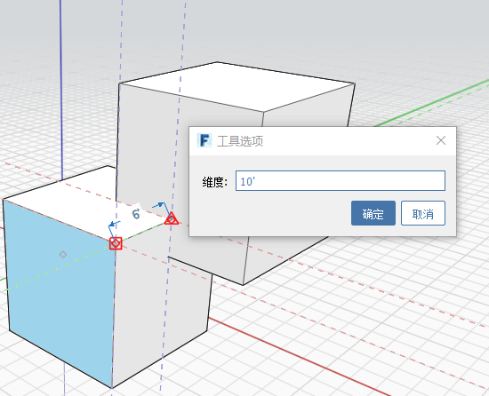

# Messen

Das Werkzeug **Messen** befindet sich im [Werkzeugkasten](../formit-introduction/tool-bars.md).

Sie können das Werkzeug **Messen** verwenden, um vorhandene Geometrie in einem Modell zu messen. Sie können auch das Werkzeug **Messen** verwenden, um der Geometrie Bemaßungen zuzuweisen.

1. Wählen Sie das Werkzeug **Messen** aus.
2. Wählen Sie zwei Punkte zum Messen des Abstands zwischen ihnen aus.
3. Wählen Sie eine Fläche oder Kante aus, die Sie anpassen möchten, klicken Sie auf den angezeigten Wert, und fügen Sie im angezeigten Dialogfeld einen neuen Wert hinzu.

  
  

